# Skill 架构设计文档

## 概述

本文档描述了 Skill（技能）系统的完整架构设计，包括分层结构、组件职责、数据流和最佳实践。

Skill 系统实现了**渐进式技能披露（Progressive Disclosure）**模式：
- 技能文件在构建时预加载到沙箱
- SkillsMiddleware 在系统提示中注入技能描述
- Agent 直接读取沙箱中的文件获取完整内容

## 架构原则

Skill 系统遵循以下设计原则：

1. **分层架构**：清晰的职责分离，每层只关注自己的职责
2. **依赖注入**：避免全局状态，通过依赖注入传递上下文
3. **异步优先**：所有数据库操作使用异步，避免事件循环冲突
4. **类型安全**：使用 Pydantic schemas 进行类型验证和序列化
5. **可测试性**：各层可独立测试，依赖关系清晰
6. **预加载优先**：技能文件在构建时预加载，运行时直接读取

## 目录结构

```
backend/app/
├── core/
│   ├── skill/                    # 核心业务逻辑层
│   │   ├── __init__.py
│   │   ├── formatter.py          # 技能内容格式化（用于 API 响应）
│   │   ├── sandbox_loader.py     # 技能文件预加载到沙箱
│   │   ├── yaml_parser.py        # SKILL.md YAML 解析
│   │   ├── validators.py         # 技能数据验证
│   │   └── ARCHITECTURE.md       # 本文档
│   └── tools/
│       └── skill/                # 工具层（当前为空）
│           └── __init__.py
├── schemas/
│   └── skill.py                 # API 数据模型和序列化
├── services/
│   └── skill_service.py         # 业务服务层（CRUD、权限）
├── repositories/
│   └── skill.py                 # 数据访问层（SQL 查询）
├── api/v1/
│   └── skills.py                # HTTP 端点（路由、请求处理）
└── core/agent/midware/
    ├── skill_adapter.py         # 适配器中间件（数据库 -> deepagents）
    └── SKILL_MIDDLEWARE.md      # 使用说明文档

注意：技能中间件使用系统库 `deepagents.middleware.skills.SkillsMiddleware`
```

## 分层架构详解

### 1. Core Layer (`core/skill/`)

**职责**：核心业务逻辑，不依赖外部服务

#### `formatter.py` - 技能格式化器

负责将技能数据格式化为字符串格式。

```python
class SkillFormatter:
    @staticmethod
    def format_skill_content(skill: Skill, include_file_contents: bool = True) -> str:
        """格式化技能内容为字符串（主要用于 API 响应）"""
        
    @staticmethod
    def format_skill_list(skills: List[Skill]) -> str:
        """格式化技能列表为 Markdown"""
        
    @staticmethod
    def format_skill_structure(skill: Skill) -> str:
        """格式化技能文件结构为树形视图"""
```

**特点**：
- 纯函数，无副作用
- 不依赖数据库或服务层
- 主要用于 API 响应，Agent 直接读取文件，不经过格式化

**用途**：
- API 响应：格式化技能内容供前端显示
- 日志记录：格式化技能信息用于日志
- 调试工具：格式化技能结构用于调试

#### `sandbox_loader.py` - 技能沙箱加载器

负责在构建时预加载技能文件到沙箱文件系统。

```python
class SkillSandboxLoader:
    """加载技能文件到沙箱环境"""
    
    SKILLS_BASE_DIR = "/workspace/skills"
    
    async def load_skill_to_sandbox(
        skill_id: uuid.UUID,
        backend: BackendProtocol,
        user_id: Optional[str] = None
    ) -> bool:
        """加载单个技能到沙箱"""
    
    async def load_skills_to_sandbox(
        skill_ids: list[uuid.UUID],
        backend: BackendProtocol,
        user_id: Optional[str] = None
    ) -> dict[uuid.UUID, bool]:
        """批量加载技能到沙箱"""
```

**特点**：
- 在构建时预加载技能文件到 `/workspace/skills/{skill_name}/`
- 每次加载前会清理现有目录（`rm -rf`），确保文件是最新的
- 处理文件路径冲突和错误
- 组织文件保持原有目录结构
- 支持权限检查（通过 `user_id` 参数）

**注意**：当前实现每次加载都会清理并重新写入文件，确保技能文件始终是最新版本。未来可能会实现基于 `updated_at` 时间戳的增量加载优化。

**文件组织**：
```
/workspace/skills/
├── skill-name-1/
│   ├── SKILL.md          # 技能说明文件（YAML frontmatter + Markdown body）
│   ├── file1.py
│   └── subdir/
│       └── file2.py
└── skill-name-2/
    └── SKILL.md
```

#### `yaml_parser.py` - YAML 解析器

解析和生成 SKILL.md 文件的 YAML frontmatter。

```python
def parse_skill_md(content: str) -> tuple[dict, str]:
    """解析 SKILL.md，提取 YAML frontmatter 和 Markdown body"""
    
def generate_skill_md(
    name: str,
    description: str,
    body: str = '',
    additional_fields: Optional[dict] = None
) -> str:
    """生成 SKILL.md 内容，包含 YAML frontmatter"""
```

**特点**：
- 解析 SKILL.md 的 YAML frontmatter（包含 name, description, tags 等）
- 提取 Markdown body（作为 skill.content）
- 生成符合规范的 SKILL.md 格式

#### `validators.py` - 验证器

技能数据验证工具。

**特点**：
- 验证技能名称格式
- 验证文件扩展名
- 验证技能数据结构

### 2. Schemas Layer (`schemas/skill.py`)

**职责**：API 数据模型定义和序列化

#### Schema 类型

- `SkillSchema`: 技能响应模型
- `SkillFileSchema`: 技能文件响应模型
- `SkillCreate`: 创建技能请求模型
- `SkillUpdate`: 更新技能请求模型
- `SkillFileCreate`: 创建技能文件请求模型

**特点**：
- 使用 `field_validator` 处理类型转换（UUID → str, datetime → str）
- `from_attributes = True` 支持从 SQLAlchemy 模型自动转换
- 清晰的字段验证和文档

### 3. Services Layer (`services/skill_service.py`)

**职责**：业务逻辑、权限校验、CRUD 操作

#### SkillService

```python
class SkillService(BaseService[Skill]):
    def __init__(self, db):
        self.repo = SkillRepository(db)
        self.file_repo = SkillFileRepository(db)
        self.formatter = SkillFormatter()  # 使用核心格式化器
    
    async def list_skills(...) -> List[Skill]:
        """获取技能列表（含权限过滤）"""
    
    async def get_skill(...) -> Skill:
        """获取技能详情（含权限检查）"""
    
    async def get_skill_by_name(...) -> Optional[Skill]:
        """根据名称查找技能（不区分大小写）"""
    
    async def format_skill_content(self, skill: Skill) -> str:
        """格式化技能内容（委托给 formatter，主要用于 API）"""
```

**特点**：
- 使用 `SkillFormatter` 进行格式化（主要用于 API 响应）
- 所有方法都进行权限检查
- 事务管理（commit/rollback）

**权限规则**：
- 私有技能：只有拥有者可以访问
- 公开技能：所有用户都可以访问
- 系统技能：`owner_id` 为 `None` 的技能，所有用户可访问

### 4. Repositories Layer (`repositories/skill.py`)

**职责**：数据访问，SQL 查询

#### SkillRepository

```python
class SkillRepository(BaseRepository[Skill]):
    async def list_by_user(...) -> List[Skill]:
        """根据用户和权限查询技能"""
    
    async def get_with_files(self, skill_id: UUID) -> Optional[Skill]:
        """获取技能及其关联文件（使用 selectinload 预加载）"""
```

**特点**：
- 纯数据访问，无业务逻辑
- 使用 SQLAlchemy ORM
- 使用 `selectinload` 预加载关联数据（files 关系）
- 支持复杂查询（权限、标签过滤等）

### 5. API Layer (`api/v1/skills.py`)

**职责**：HTTP 端点、请求处理、响应序列化

#### 端点列表

- `GET /api/v1/skills` - 获取技能列表
- `POST /api/v1/skills` - 创建技能
- `GET /api/v1/skills/{skill_id}` - 获取技能详情
- `PUT /api/v1/skills/{skill_id}` - 更新技能
- `DELETE /api/v1/skills/{skill_id}` - 删除技能
- `POST /api/v1/skills/{skill_id}/files` - 添加文件
- `DELETE /api/v1/skills/files/{file_id}` - 删除文件

**特点**：
- 使用 Pydantic schemas 进行请求/响应验证
- 自动序列化（UUID、datetime 转换）
- 统一的错误处理
- 权限检查在 Service 层进行

### 6. Middleware Layer

**职责**：在 Agent 执行过程中注入技能支持

#### SkillsMiddleware (deepagents)

使用系统库 `deepagents.middleware.skills.SkillsMiddleware`：

```python
from deepagents.middleware.skills import SkillsMiddleware

middleware = SkillsMiddleware(
    backend=backend,  # BackendProtocol 实例
    sources=["/workspace/skills/"],  # 技能源路径
)
```

**特点**：
- 渐进式技能披露（Progressive Disclosure）
- 在系统提示中注入技能描述（从 SKILL.md 的 YAML frontmatter 读取）
- 从 BackendProtocol 读取预加载的技能文件
- 支持多个 sources，后面的源覆盖前面的

**重要**：
- 技能文件必须通过 `SkillSandboxLoader` 预加载到 `/workspace/skills/`
- 只在系统提示中显示技能名称和描述，不加载完整内容
- Agent 根据描述决定需要哪个技能，然后直接读取文件

#### DatabaseSkillAdapter (可选)

适配器中间件，用于没有持久化 backend 的场景：

```python
from app.core.agent.midware.skill_adapter import DatabaseSkillAdapter

middleware = DatabaseSkillAdapter(
    user_id="user-123",
    skill_ids=[uuid1, uuid2],  # 可选：指定技能ID列表
    db_session_factory=async_session_factory,
)
```

**特点**：
- 在运行时从数据库加载技能（首次调用 `before_agent` 时）
- 写入临时 StateBackend（内存后端，不持久化）
- 使用 deepagents SkillsMiddleware 提供技能描述
- 适用于没有持久化 backend 的 Agent 场景

**使用场景**：
- 常规 Agent 没有配置持久化 backend
- 需要技能描述注入但不需要文件持久化
- 临时 Agent 或测试场景

**注意**：DatabaseSkillAdapter 会在每次 Agent 启动时从数据库加载技能，性能不如预加载方式。对于生产环境，建议使用预加载方式。

## 数据流

### 技能预加载流程

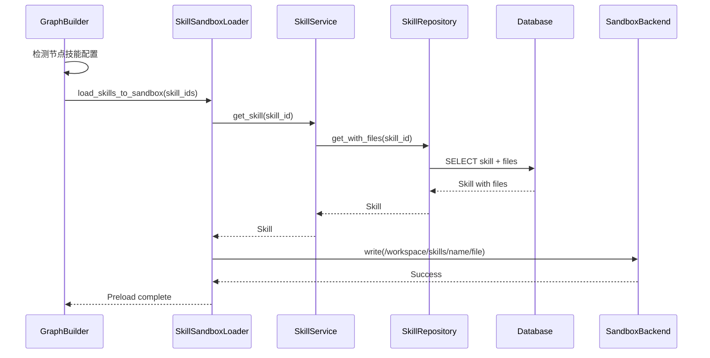

### Agent 使用技能流程

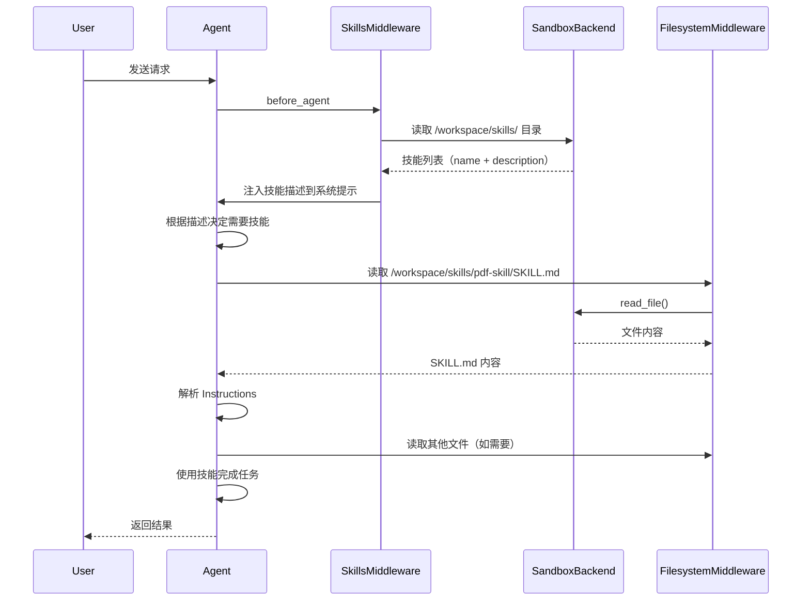

### API 请求流程

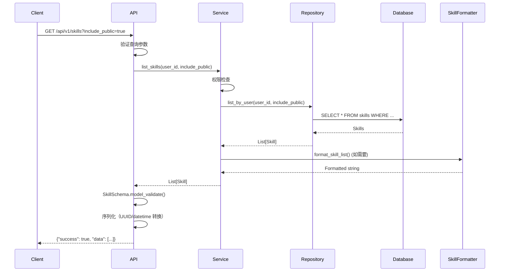

## 关键设计决策

### 1. 为什么 Agent 直接读取文件而不是通过工具？

**原因**：
- ✅ 文件已经预加载到沙箱，无需重复加载
- ✅ 架构更清晰：预加载阶段和运行时阶段分离
- ✅ 性能更好：避免数据库查询和格式化开销
- ✅ Agent 可以按需读取，只加载需要的文件
- ✅ 利用 FilesystemMiddleware 的现有文件访问能力

**对比**：
- ❌ 通过工具加载：需要数据库查询 → 格式化 → 返回字符串 → 增加上下文
- ✅ 直接读取文件：从沙箱读取 → 立即使用 → 按需加载

### 2. 为什么使用 TYPE_CHECKING？

在 `sandbox_loader.py` 中：

```python
if TYPE_CHECKING:
    from app.services.skill_service import SkillService

def __init__(self, skill_service: "SkillService"):
```

**原因**：
- 避免循环导入：`skill_service` → `skill.formatter` → `skill.sandbox_loader` → `skill_service`
- 类型检查时仍然有类型提示
- 运行时不会导入，避免循环

### 3. 为什么使用 field_validator？

在 `schemas/skill.py` 中：

```python
@field_validator("id", mode="before")
@classmethod
def convert_uuid_to_str(cls, v):
    if isinstance(v, uuid.UUID):
        return str(v)
    return v
```

**原因**：
- 数据库模型使用 `uuid.UUID` 和 `datetime`
- API 响应需要字符串格式
- `mode="before"` 在验证前转换，确保类型匹配

### 4. 为什么在构建时预加载？

**原因**：
- ✅ 避免运行时延迟：预加载在构建时完成，不影响 Agent 响应时间
- ✅ 支持增量加载：已加载的技能不会重复加载
- ✅ 错误提前发现：构建时发现技能加载问题
- ✅ 支持共享后端：DeepAgents 中所有节点共享同一个沙箱

### 5. SkillFormatter 的用途

**主要用途**：
- API 响应：格式化技能内容供前端显示
- 日志记录：格式化技能信息用于日志输出
- 调试工具：格式化技能结构用于调试

**不在以下场景使用**：
- ❌ Agent 获取技能内容：Agent 直接读取文件，不经过格式化
- ❌ 技能预加载：预加载直接将文件写入沙箱，不格式化

## 依赖关系图

```
┌─────────────────┐
│   API Layer     │
│  (api/v1/...)   │
└────────┬────────┘
         │ uses
         ▼
┌─────────────────┐      ┌─────────────────┐
│  Service Layer  │──────│   Core Layer    │
│ (skill_service) │ uses │  (core/skill)   │
└────────┬────────┘      │  - formatter    │
         │               │  - sandbox_loader│
         │ uses          │  - yaml_parser  │
         ▼               └─────────────────┘
┌─────────────────┐              │
│ Repository Layer │              │
│ (repositories)   │              │
└────────┬─────────┘              │
         │                        │
         ▼                        │
┌─────────────────┐              │
│   Database      │              │
└─────────────────┘              │
                                 │
┌─────────────────┐              │
│ Graph Builder   │──────────────┘
│ (deep_agents)   │ uses (preload)
└────────┬────────┘
         │
         ▼
┌─────────────────┐
│ Sandbox Backend │
│ (/workspace/skills/)│
└────────┬────────┘
         │
         ▼
┌─────────────────┐
│  Middleware     │
│ (SkillsMiddleware)│
└────────┬────────┘
         │
         ▼
┌─────────────────┐
│     Agent       │
│ (reads files)   │
└─────────────────┘
```

## 完整工作流程

### 阶段 1：构建时预加载

#### DeepAgents 预加载流程

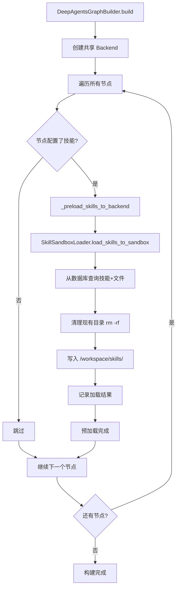

#### 常规 Agent 预加载流程

常规 Agent（`sample_agent.py`）的预加载流程：

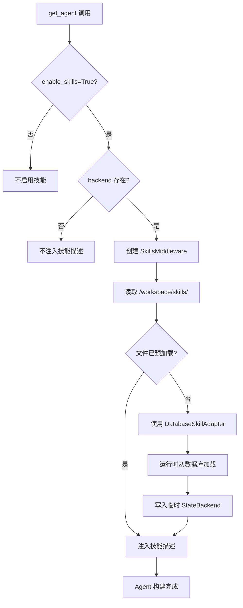

**常规 Agent 预加载说明**：
- 常规 Agent **不自动预加载**技能文件
- 如果 backend 存在且技能文件已预加载（通过外部方式），则使用 SkillsMiddleware
- 如果 backend 不存在或文件未预加载，可以使用 DatabaseSkillAdapter 在运行时加载
- 常规 Agent 的预加载需要**外部调用** `SkillSandboxLoader` 或使用 DatabaseSkillAdapter

### 阶段 2：运行时使用

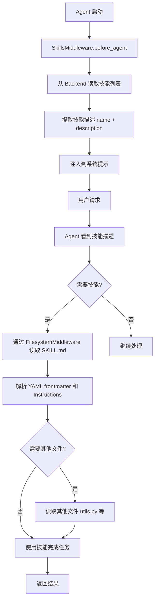

### Agent 读取文件示例

Agent 通过 FilesystemMiddleware 读取技能文件：

```python
# Agent 在系统提示中看到技能描述后，决定使用某个技能
# 例如：看到 "pdf-skill: 处理 PDF 文件的专业技能"

# 1. 读取 SKILL.md 获取完整说明
content = read_file("/workspace/skills/pdf-skill/SKILL.md")
# 返回：
# ---
# name: pdf-skill
# description: 处理 PDF 文件的专业技能
# ---
# 
# # PDF 处理技能
# 
# ## 功能
# - 解析 PDF 内容
# - 提取文本
# ...

# 2. 根据需要读取其他文件
utils_code = read_file("/workspace/skills/pdf-skill/utils.py")
example = read_file("/workspace/skills/pdf-skill/examples/sample.pdf")

# 3. 使用技能完成任务
# Agent 根据 Instructions 执行相应操作
```

**文件读取机制**：
- FilesystemMiddleware 提供 `read_file` 工具
- 使用 BackendProtocol 的 `read()` 方法
- 支持相对路径和绝对路径
- 文件路径必须位于 backend 的 `root_dir` 内（如果启用 `virtual_mode`）

## 最佳实践

### 1. 添加新功能

- **格式化逻辑** → 添加到 `core/skill/formatter.py`
- **业务逻辑** → 添加到 `services/skill_service.py`
- **数据查询** → 添加到 `repositories/skill.py`
- **API 端点** → 添加到 `api/v1/skills.py`
- **沙箱加载** → 添加到 `core/skill/sandbox_loader.py`
- **YAML 解析** → 添加到 `core/skill/yaml_parser.py`

### 2. 避免循环导入

- 使用 `TYPE_CHECKING` 进行类型提示
- 使用字符串类型提示 `"SkillService"`
- Core 层不导入 Service 层
- SandboxLoader 通过参数接收 SkillService，不直接导入

### 3. 类型转换

- UUID → str：使用 `field_validator`
- datetime → str：使用 `field_validator`
- 在 schema 中处理，不在 API 层手动转换

### 4. 错误处理

#### 错误处理策略

**预加载阶段错误处理**：

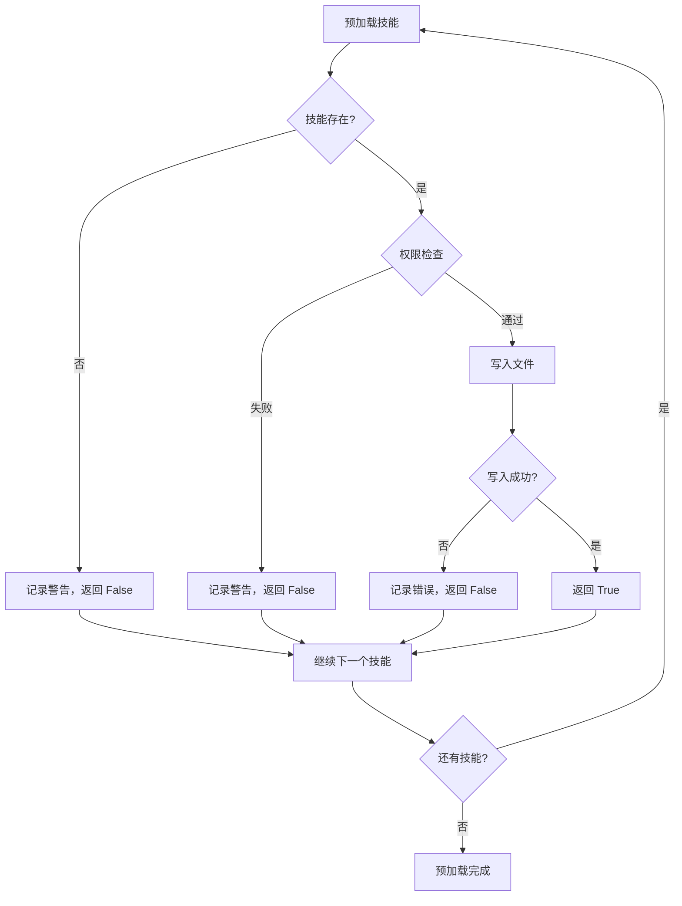

**错误处理原则**：
- **预加载失败不阻止构建**：单个技能加载失败不影响其他技能和 Agent 构建
- **记录详细日志**：所有错误都记录到日志，包括技能ID、错误原因、堆栈信息
- **返回状态字典**：`load_skills_to_sandbox` 返回 `dict[uuid.UUID, bool]`，调用者可以检查每个技能的状态
- **权限检查**：在加载前检查用户权限，避免加载无权限的技能

**运行时错误处理**：

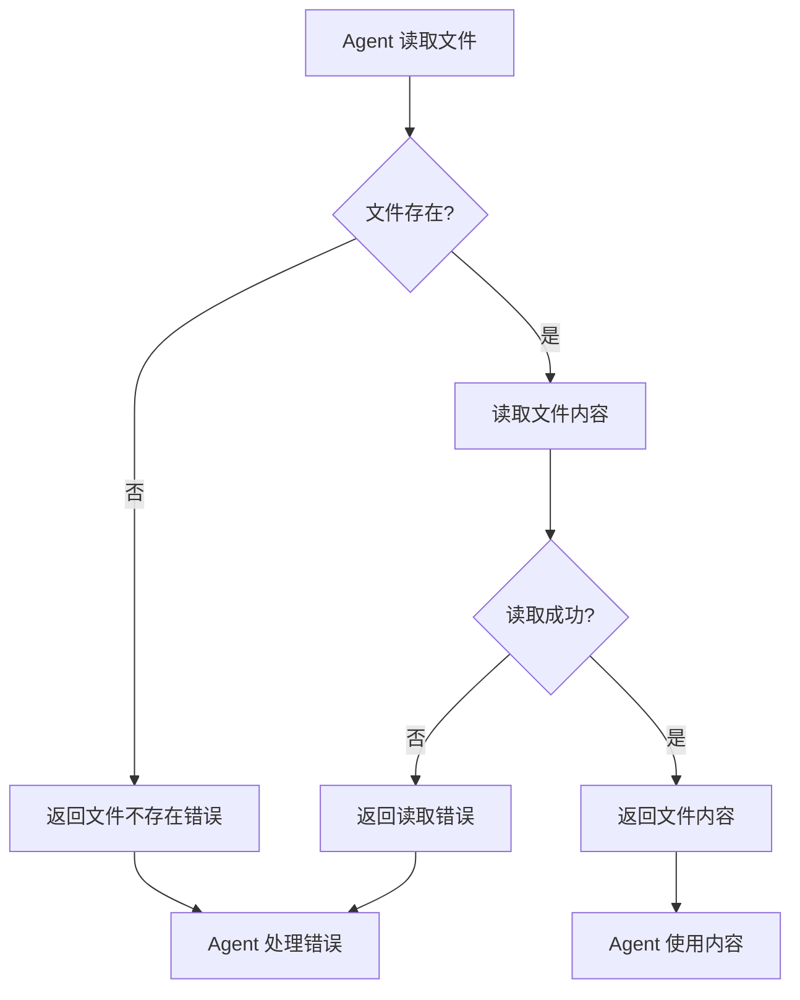

**常见错误场景**：

1. **技能不存在**：
   - 预加载时：记录警告，跳过该技能
   - 运行时：Agent 无法找到技能文件，返回错误

2. **权限不足**：
   - 预加载时：`SkillService.get_skill` 返回 `None`，记录警告
   - 运行时：如果文件未预加载，Agent 无法访问

3. **文件写入失败**：
   - 预加载时：记录错误，返回 `False`
   - 不影响其他文件的写入

4. **文件读取失败**：
   - 运行时：FilesystemMiddleware 返回错误
   - Agent 可以处理错误或尝试其他方式

**错误日志示例**：

```python
# 预加载错误
logger.warning(f"Skill {skill_id} not found or access denied")
logger.error(f"Failed to load skill {skill_id} to sandbox: {e}", exc_info=True)

# 文件写入错误
logger.error(f"Failed to write file {file_path} for skill '{skill.name}': {e}")

# 运行时错误（由 FilesystemMiddleware 处理）
# Agent 会收到文件不存在的错误响应
```

### 5. 技能文件组织

- 使用清晰的目录结构
- SKILL.md 放在根目录
- 相关文件组织在子目录中
- 使用描述性的文件名

### 6. 预加载策略

- 在构建时预加载所有配置的技能
- 每次加载前清理现有目录，确保文件是最新的
- 支持共享后端（DeepAgents）和独立后端（常规 Agent）
- 预加载失败不应阻止 Agent 构建（但应记录警告）

### 7. 使用场景对比

#### 预加载方式 vs DatabaseSkillAdapter

| 特性 | 预加载方式 | DatabaseSkillAdapter |
|------|-----------|---------------------|
| **Backend 要求** | 需要持久化 Backend | 不需要持久化 Backend |
| **加载时机** | 构建时预加载 | 运行时首次调用时加载 |
| **性能** | ✅ 高性能（文件已就绪） | ⚠️ 每次启动需要加载 |
| **文件持久化** | ✅ 文件持久化在 Backend | ❌ 临时 StateBackend（内存） |
| **适用场景** | DeepAgents、生产环境 | 常规 Agent、测试环境 |
| **技能更新** | 需要重新构建 | 每次启动自动更新 |
| **资源占用** | 持久化存储 | 内存占用 |

#### 选择建议

**使用预加载方式**：
- ✅ DeepAgents 场景（共享 Backend）
- ✅ 生产环境
- ✅ 需要文件持久化
- ✅ 性能要求高

**使用 DatabaseSkillAdapter**：
- ✅ 常规 Agent 没有持久化 Backend
- ✅ 测试环境
- ✅ 临时 Agent
- ✅ 需要每次启动时获取最新技能

#### 决策流程图

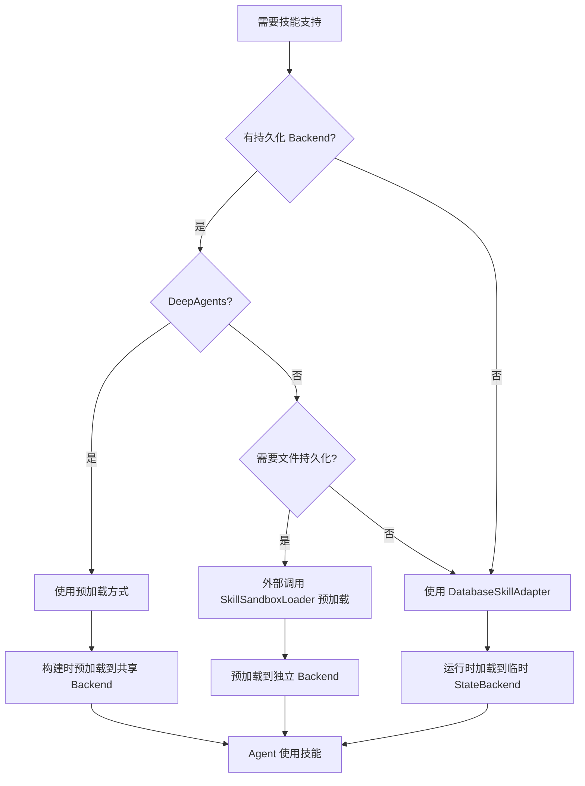

## 测试建议

### 单元测试

- **Formatter**: 测试格式化逻辑，输入 Skill 对象，验证输出格式
- **SandboxLoader**: Mock SkillService 和 Backend，测试文件加载和错误处理
- **YAMLParser**: 测试 YAML 解析和生成
- **Service**: Mock Repository，测试业务逻辑和权限
- **Repository**: 使用测试数据库，测试 SQL 查询

### 集成测试

- **API**: 测试完整的 HTTP 请求/响应流程
- **Sandbox Loader**: 测试技能文件预加载到沙箱（使用真实的 Backend）
- **Middleware**: 测试技能注入和文件读取
- **完整流程**: 测试从预加载到 Agent 使用的完整流程

## 性能考虑

1. **数据库查询优化**
   - 使用 `selectinload` 预加载关联数据（files 关系）
   - 添加适当的索引（owner_id, is_public, tags）
   - 批量查询技能文件

2. **增量加载**
   - 使用缓存跟踪已加载的技能
   - 通过 `updated_at` 时间戳判断是否需要重新加载
   - 减少不必要的文件写入操作

3. **文件读取**
   - Agent 直接读取沙箱中的文件（通过 FilesystemMiddleware）
   - 按需读取，只加载需要的文件
   - 避免一次性加载所有文件内容到上下文

4. **共享后端**
   - DeepAgents 中所有节点共享同一个 Docker 容器
   - 技能文件只需加载一次，所有节点可访问
   - 减少资源占用和启动时间

## 共享后端管理

### DeepAgents 共享后端机制

DeepAgents 使用共享后端来优化资源使用和文件访问：

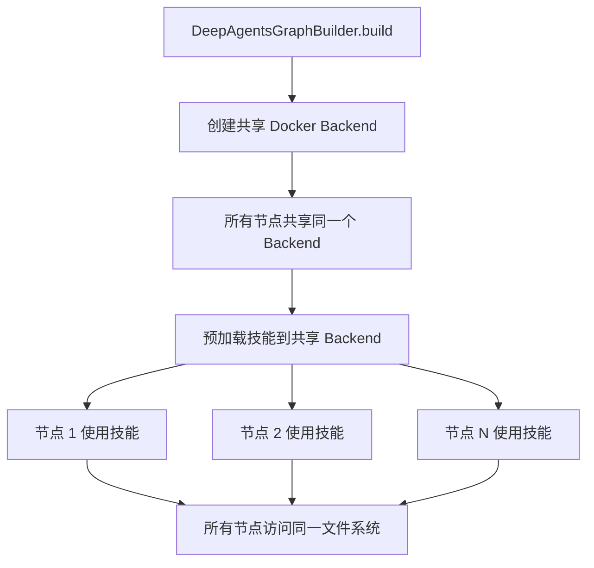

**共享后端创建流程**：

```python
# 1. DeepAgentsGraphBuilder 在 build() 时创建共享后端
self._shared_backend = await self._create_shared_backend()

# 2. 所有节点配置时使用共享后端
backend = self._shared_backend if self._shared_backend else None

# 3. 预加载技能到共享后端
await self._preload_skills_to_backend(node, self._shared_backend)

# 4. 所有节点都可以访问预加载的技能文件
# /workspace/skills/ 目录在所有节点中可见
```

**共享后端生命周期**：

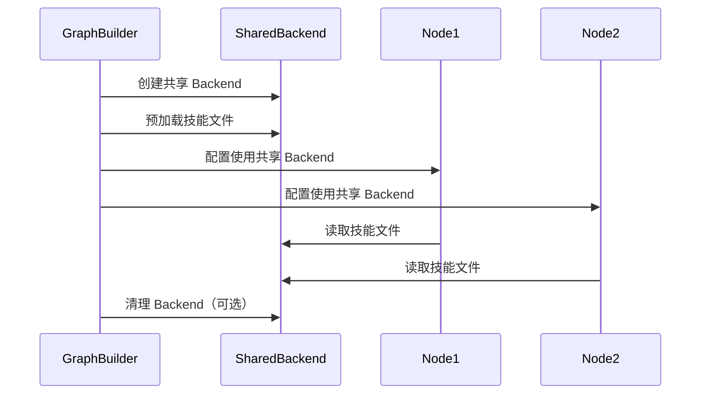

**共享后端优势**：
- ✅ **资源优化**：所有节点共享同一个 Docker 容器，减少资源占用
- ✅ **文件共享**：技能文件只需加载一次，所有节点可访问
- ✅ **数据持久化**：节点间可以共享文件和数据
- ✅ **性能提升**：避免重复加载技能文件

**共享后端注意事项**：
- ⚠️ 所有节点共享同一个文件系统，需要注意文件冲突
- ⚠️ 一个节点修改文件可能影响其他节点
- ⚠️ Backend 清理时需要确保所有节点都已停止使用

**Backend 清理机制**：

```python
# DeepAgentsGraphBuilder 提供清理函数
async def cleanup_backend():
    """清理共享后端"""
    if self._shared_backend:
        await self._shared_backend.cleanup()
        self._shared_backend = None
```

清理时机：
- Graph 销毁时自动清理
- 可以手动调用清理函数
- 清理是幂等的（可以安全地多次调用）

## 技能数据结构

### Skill 模型

```python
class Skill:
    id: UUID                    # 技能 ID
    name: str                   # 技能名称（唯一标识，用于文件路径）
    description: str            # 简短描述（显示在系统提示中）
    content: str                # SKILL.md 的 body 部分（Instructions）
    tags: List[str]             # 标签列表
    is_public: bool             # 是否公开
    owner_id: Optional[str]     # 拥有者 ID（None 表示系统技能）
    files: List[SkillFile]      # 关联的文件
    created_at: datetime
    updated_at: datetime
```

### SKILL.md 格式

```markdown
---
name: pdf-skill
description: 处理 PDF 文件的专业技能
tags: [pdf, document]
license: MIT
---

# PDF 处理技能

## 功能
- 解析 PDF 内容
- 提取文本
- 处理表格数据

## 使用方法
...
```

### 文件路径映射

- **数据库**：SkillFile 存储相对路径（如 `utils.py`, `examples/sample.pdf`）
- **沙箱**：写入 `/workspace/skills/{skill_name}/{relative_path}`
- **Agent 访问**：通过 FilesystemMiddleware 读取绝对路径

## 常见问题

### Q1: 常规 Agent 如何预加载技能？

**A**: 常规 Agent（`sample_agent.py`）不自动预加载技能。有两种方式：

1. **外部预加载**：在创建 Agent 前，手动调用 `SkillSandboxLoader` 预加载技能到 Backend
2. **使用 DatabaseSkillAdapter**：如果没有持久化 Backend，使用 `DatabaseSkillAdapter` 在运行时加载

### Q2: 技能文件更新后需要重新构建吗？

**A**: 对于预加载方式：
- DeepAgents：需要重新构建 Graph，因为技能文件在构建时预加载
- 常规 Agent：如果使用外部预加载，需要重新预加载；如果使用 DatabaseSkillAdapter，每次启动会自动获取最新技能

### Q3: 为什么预加载失败不影响 Agent 构建？

**A**: 预加载失败只影响该技能的可用性，不影响 Agent 的核心功能。Agent 仍然可以运行，只是无法使用该技能。这种设计保证了系统的健壮性。

### Q4: 如何调试技能加载问题？

**A**: 
1. 检查日志：所有加载操作都会记录详细日志
2. 检查权限：确保 `user_id` 有权限访问技能
3. 检查 Backend：确保 Backend 正常工作
4. 检查文件路径：确保技能文件路径正确

### Q5: 共享后端和独立后端有什么区别？

**A**: 
- **共享后端**：DeepAgents 中所有节点共享同一个 Docker 容器，文件持久化，性能更好
- **独立后端**：每个 Agent 有独立的 Backend，文件隔离，适合多租户场景

### Q6: 技能文件可以动态更新吗？

**A**: 当前不支持热重载。技能文件更新后需要：
- 预加载方式：重新构建 Graph
- DatabaseSkillAdapter：重启 Agent

未来可能会支持基于 `updated_at` 时间戳的增量更新。

## 未来增强

- [ ] 技能版本控制
- [ ] 技能使用统计和分析
- [ ] 技能搜索和过滤增强
- [ ] 技能文件增量更新机制（基于 `updated_at` 时间戳）
- [ ] 技能依赖关系管理
- [ ] 技能文件缓存优化
- [ ] 支持技能文件的热重载
- [ ] 技能文件变更通知机制

## 相关文档

- [Skill Middleware 使用说明](../agent/midware/SKILL_MIDDLEWARE.md) - 详细的使用说明和示例
- [Skill API 文档](../../../api/v1/skills.py) - API 端点文档
- [Skill Service 文档](../../../services/skill_service.py) - Service 层文档
- [Skill Repository 文档](../../../repositories/skill.py) - Repository 层文档
