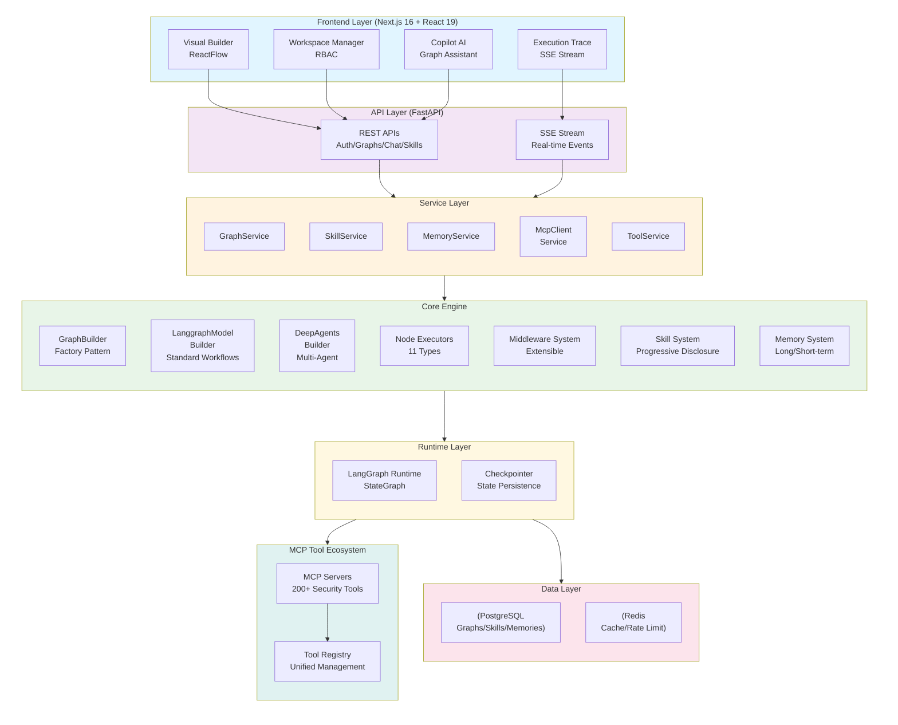
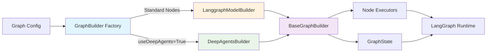
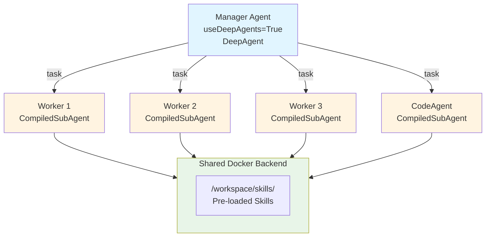
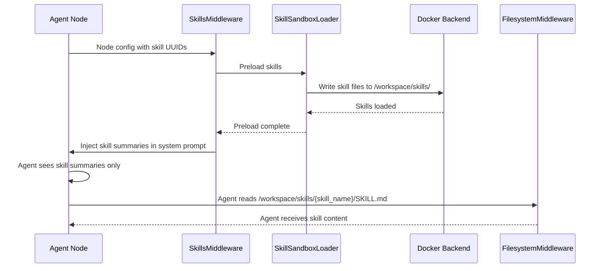
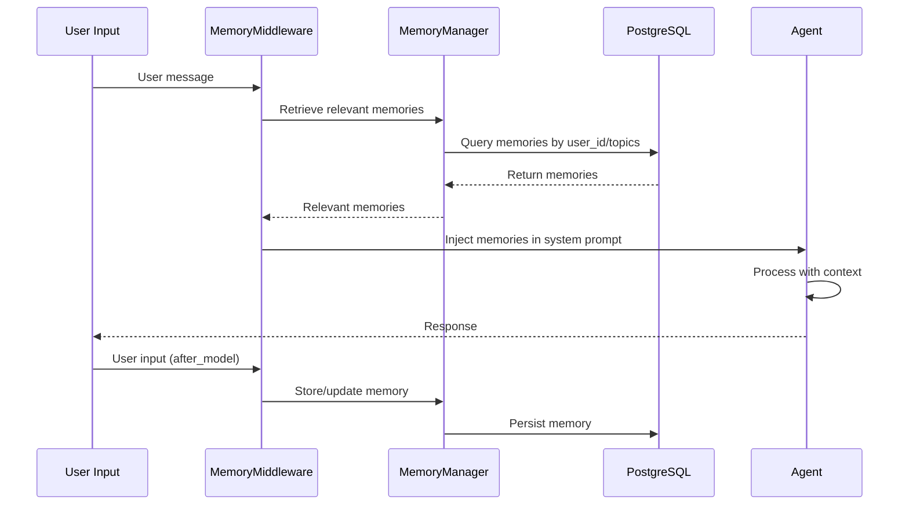
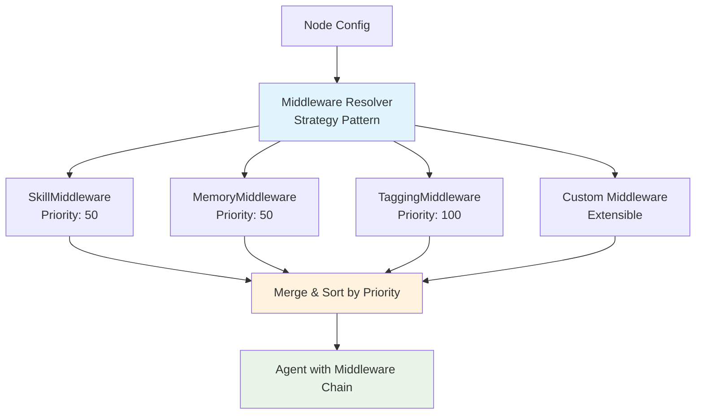
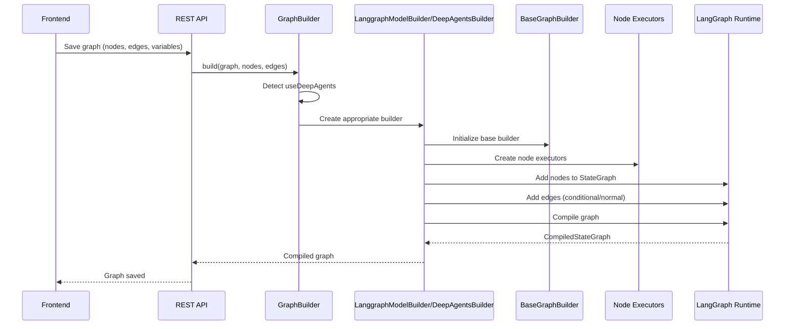
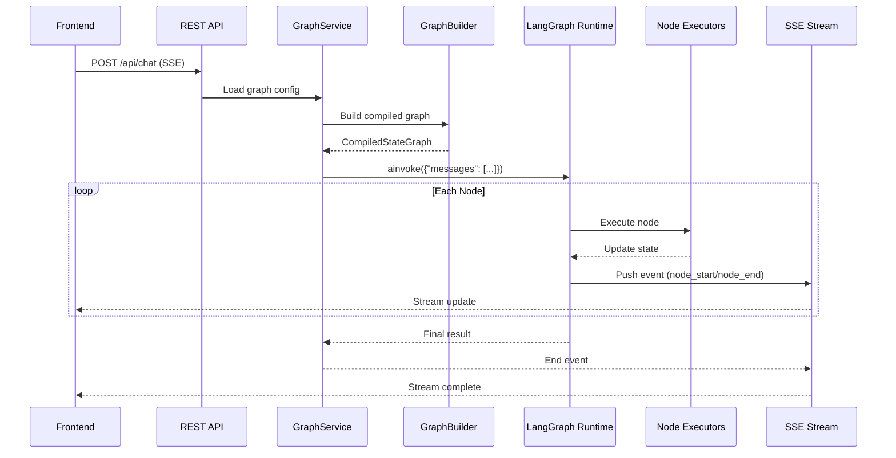
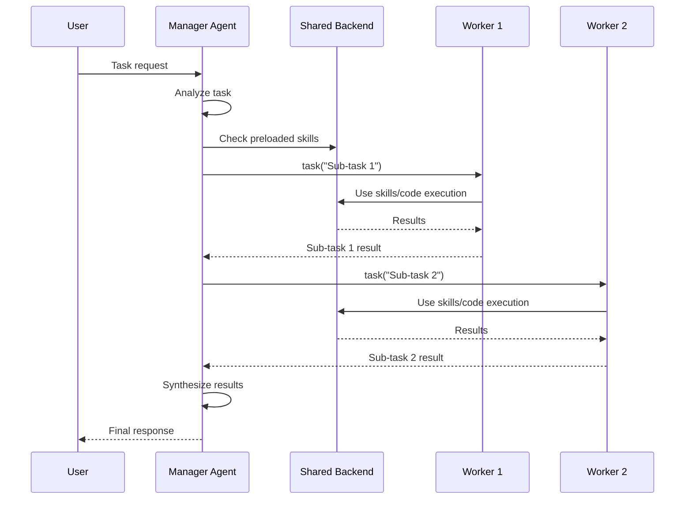

# Architecture

## Overall Architecture

JoySafeter follows a layered architecture pattern with clear separation of concerns:

### Core Modules

#### 1. Graph Builder System

The graph builder system uses a factory pattern to automatically select the appropriate builder based on graph configuration:

**Key Components:**
- **GraphBuilder**: Factory class that auto-detects configuration and selects builder
- **LanggraphModelBuilder**: Builds standard LangGraph workflows with 11 node types
- **DeepAgentsGraphBuilder**: Builds Manager-Worker star topology for multi-agent collaboration
- **BaseGraphBuilder**: Base class providing common functionality (node/edge management, executor creation)

#### 2. DeepAgents Multi-Agent Orchestration

DeepAgents implements a star topology with one Manager coordinating multiple Workers:

**Features:**
- **Star Topology**: Manager connects directly to all SubAgents (not chain)
- **Shared Backend**: Docker backend shared across agents for skills and code execution
- **Skill Preloading**: Skills loaded to `/workspace/skills/` before execution
- **Task Delegation**: Manager uses `task()` tool to delegate work to SubAgents

#### 3. Skill System (Progressive Disclosure)

The skill system implements progressive disclosure to reduce token consumption:

**Components:**
- **SkillService**: CRUD operations with permission control
- **SkillsMiddleware**: Automatically injects skill descriptions into system prompts
- **SkillSandboxLoader**: Preloads skills to Docker backend before execution
- **FilesystemMiddleware**: Agent directly reads skill files from `/workspace/skills/{skill_name}/` via filesystem access (skills are preloaded by SkillSandboxLoader before execution)

#### 4. Memory System (Long/Short-term Memory)

The memory system provides persistent memory across sessions:

**Memory Types:**
- **Fact**: Factual knowledge (target info, vulnerabilities)
- **Procedure**: Procedural knowledge (successful attack paths)
- **Episodic**: Session-specific experiences
- **Semantic**: General security knowledge

#### 5. Middleware Architecture

Extensible middleware system using strategy pattern:

**Features:**
- **Strategy Pattern**: Easy to add new middleware types
- **Priority System**: Middleware executed in priority order
- **Error Isolation**: Failed middleware doesn't break others
- **Backward Compatible**: New features don't affect existing code

#### 6. Node Executors (11 Types)

| Category | Node Types | Description |
|----------|------------|-------------|
| **Agent** | `agent`, `llm_node` | LLM-powered reasoning with tool access |
| **Control Flow** | `condition`, `router_node`, `loop_condition_node` | Conditional branching, multi-path routing, iteration |
| **Actions** | `tool_node`, `function_node`, `http_request_node` | Tool execution, sandbox code, HTTP calls |
| **Data** | `json_parser_node`, `direct_reply` | JSON parsing, template responses |
| **Aggregation** | `aggregator_node` | Parallel result collection |

### Core Workflows

#### Graph Building Flow

#### Graph Execution Flow

#### DeepAgents Execution Flow

### Data Flow

**Frontend ↔ Backend:**
- **REST API**: Graph configuration, skill management, tool management, workspace operations
- **SSE Stream**: Real-time execution status, streaming output, node execution events

**Backend Internal:**
- **GraphBuilder → NodeExecutors → LangGraph Runtime**: Graph construction and execution
- **LangGraph Runtime → MCP Servers → Tools**: Tool invocation and execution
- **Middleware → Agent → Model**: Request processing pipeline

**Backend ↔ Data Layer:**
- **PostgreSQL**: Graph configurations, skills, memories, sessions, workspaces
- **Redis**: Cache, rate limiting, session state, temporary data
