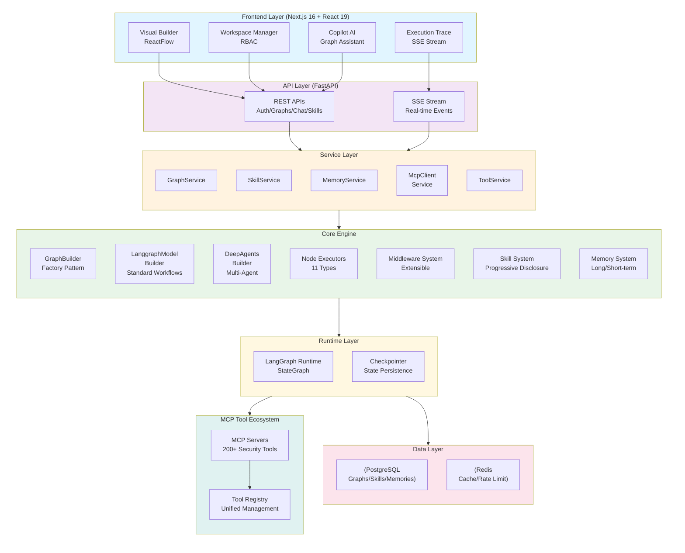
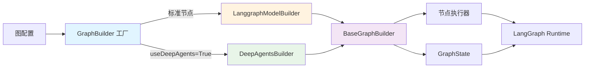
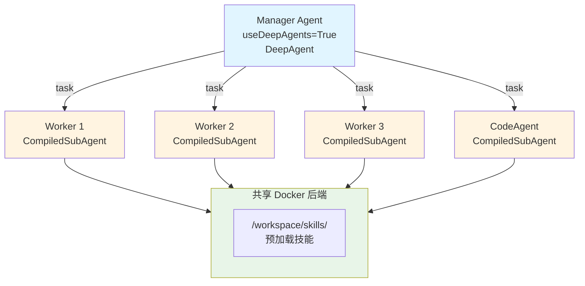
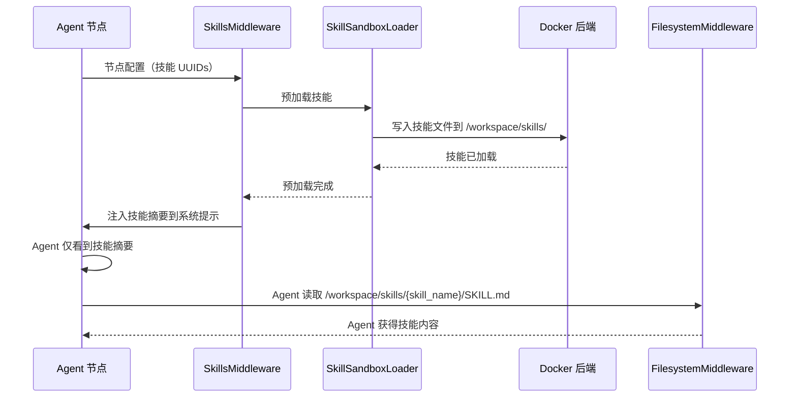
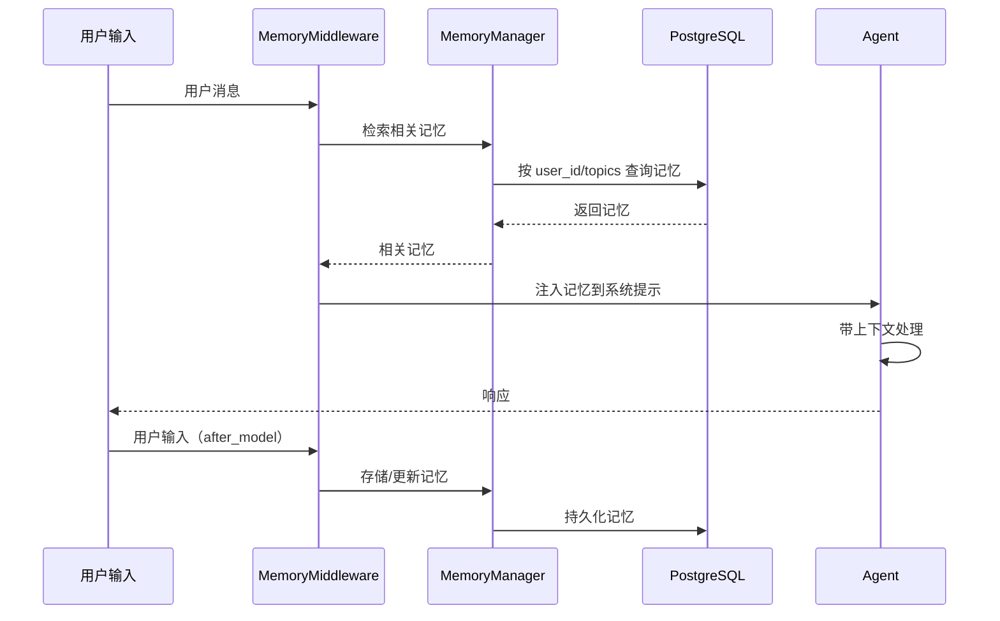
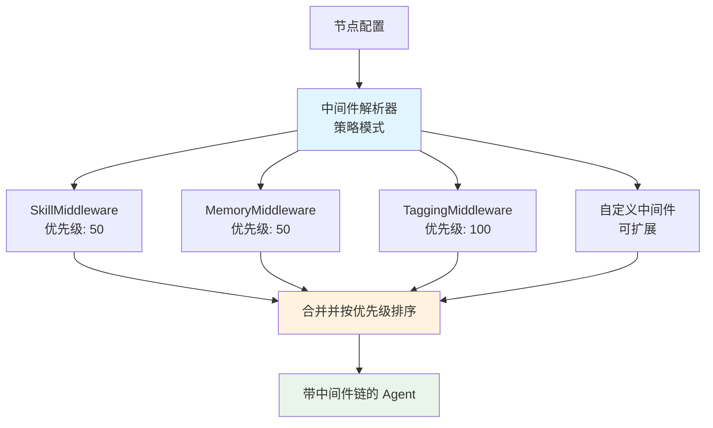
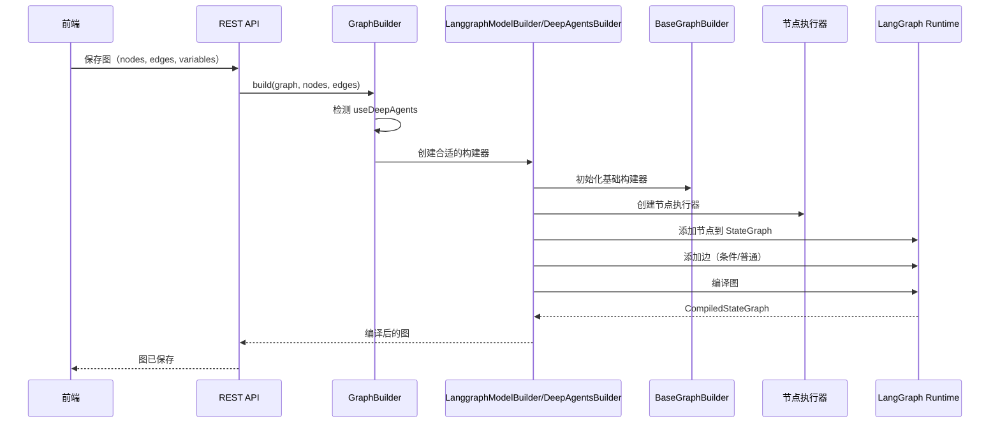
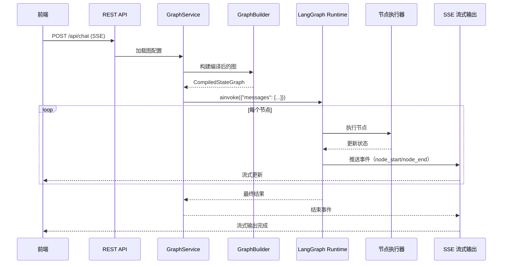
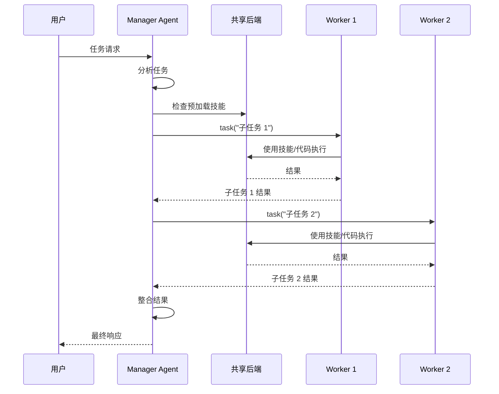

# 架构设计

## 整体架构

JoySafeter 采用分层架构模式，各层职责清晰：

### 核心模块

#### 1. 图构建系统

图构建系统采用工厂模式，根据图配置自动选择合适的构建器：

**核心组件：**
- **GraphBuilder**: 工厂类，自动检测配置并选择构建器
- **LanggraphModelBuilder**: 构建标准 LangGraph 工作流，支持 11 种节点类型
- **DeepAgentsGraphBuilder**: 构建 Manager-Worker 星型拓扑，实现多智能体协作
- **BaseGraphBuilder**: 基础类，提供通用功能（节点/边管理、执行器创建）

#### 2. DeepAgents 多智能体编排

DeepAgents 实现星型拓扑，一个 Manager 协调多个 Worker：

**特性：**
- **星型拓扑**: Manager 直接连接到所有 SubAgents（非链式）
- **共享后端**: Docker 后端在多个 Agent 间共享，用于技能和代码执行
- **技能预加载**: 执行前将技能加载到 `/workspace/skills/`
- **任务委托**: Manager 使用 `task()` 工具将工作委托给 SubAgents

#### 3. 技能系统（渐进式披露）

技能系统实现渐进式披露，减少 Token 消耗：

**组件：**
- **SkillService**: CRUD 操作，权限控制，标签分类
- **SkillsMiddleware**: 自动将技能描述注入到系统提示中
- **SkillSandboxLoader**: 执行前将技能预加载到 Docker 后端
- **FilesystemMiddleware**: Agent 通过文件系统直接读取 `/workspace/skills/{skill_name}/` 目录下的技能文件（技能由 SkillSandboxLoader 在执行前预加载）

#### 4. 记忆系统（长短期记忆）

记忆系统提供跨会话的持久化记忆：

**记忆类型：**
- **Fact（事实）**: 事实性知识（目标信息、漏洞）
- **Procedure（过程）**: 过程性知识（成功的攻击路径）
- **Episodic（情景）**: 会话特定的经验
- **Semantic（语义）**: 通用安全知识

#### 5. 中间件架构

使用策略模式的可扩展中间件系统：

**特性：**
- **策略模式**: 易于添加新的中间件类型
- **优先级系统**: 按优先级顺序执行中间件
- **错误隔离**: 失败的中间件不会影响其他中间件
- **向后兼容**: 新功能不影响现有代码

#### 6. 节点执行器（11 种类型）

| 分类 | 节点类型 | 说明 |
|------|----------|------|
| **智能体** | `agent`, `llm_node` | LLM 驱动的推理节点，支持工具调用 |
| **控制流** | `condition`, `router_node`, `loop_condition_node` | 条件分支、多路由、循环迭代 |
| **动作** | `tool_node`, `function_node`, `http_request_node` | 工具执行、沙箱代码、HTTP 请求 |
| **数据** | `json_parser_node`, `direct_reply` | JSON 解析、模板响应 |
| **聚合** | `aggregator_node` | 并行结果收集 |

### 核心流程

#### 图构建流程

#### 图执行流程

#### DeepAgents 执行流程

### 数据流

**前端 ↔ 后端：**
- **REST API**: 图配置、技能管理、工具管理、工作区操作
- **SSE 流式输出**: 实时执行状态、流式输出、节点执行事件

**后端内部：**
- **GraphBuilder → NodeExecutors → LangGraph Runtime**: 图构建和执行
- **LangGraph Runtime → MCP Servers → Tools**: 工具调用和执行
- **Middleware → Agent → Model**: 请求处理管道

**后端 ↔ 数据层：**
- **PostgreSQL**: 图配置、技能、记忆、会话、工作区
- **Redis**: 缓存、限流、会话状态、临时数据
