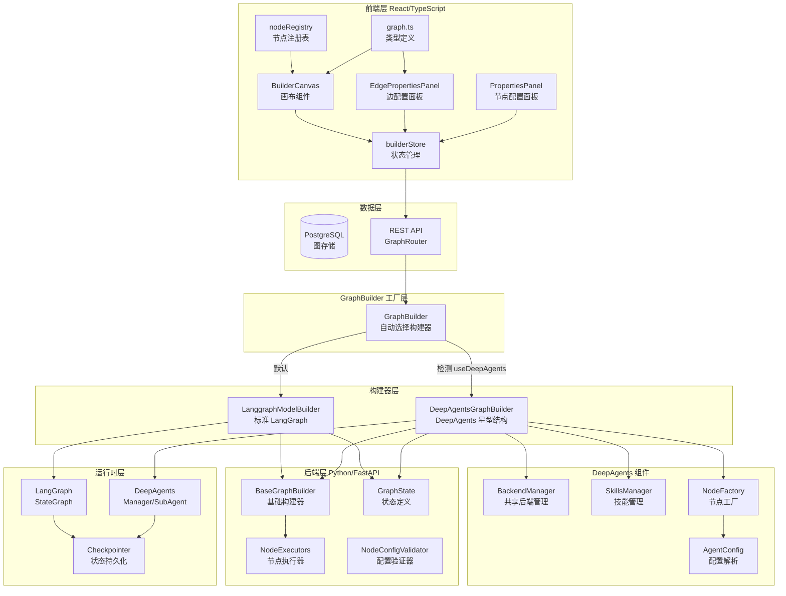
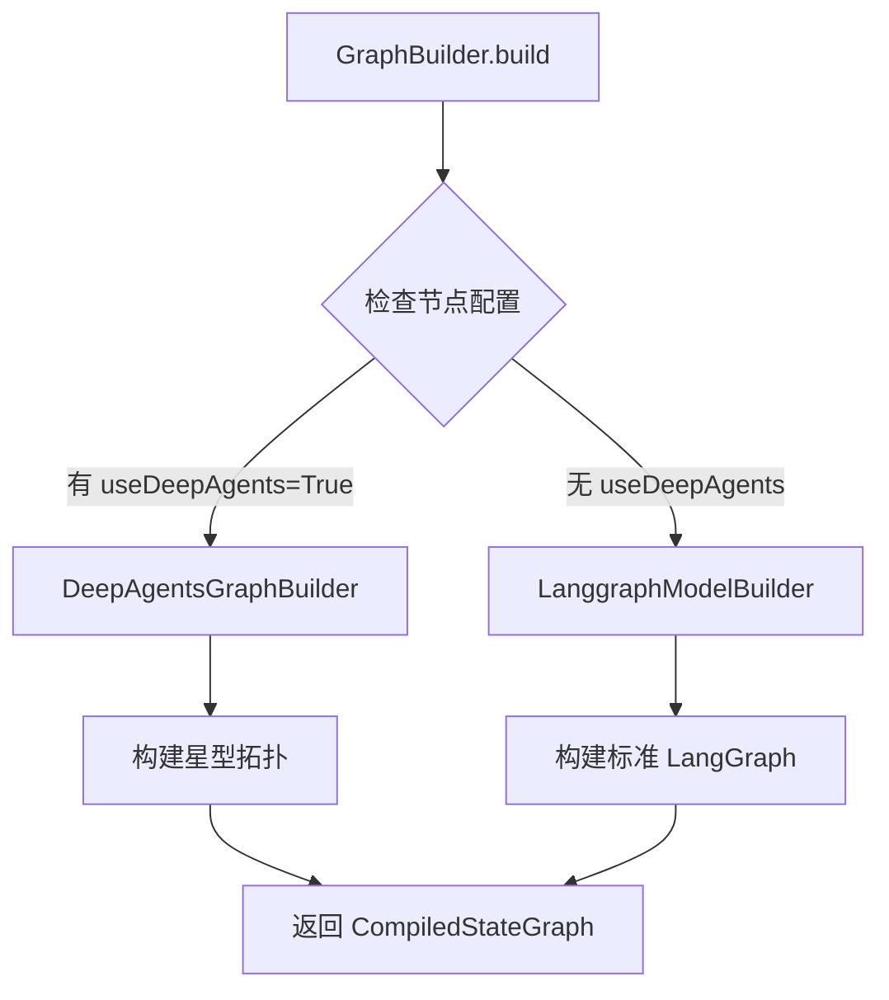
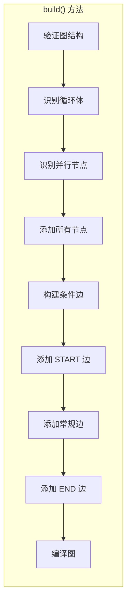
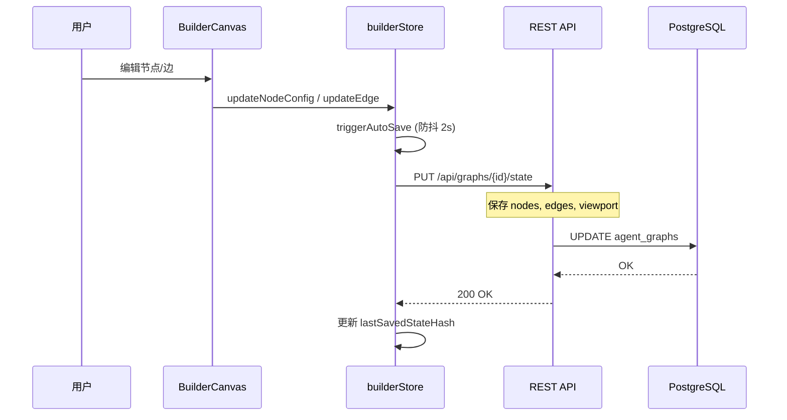
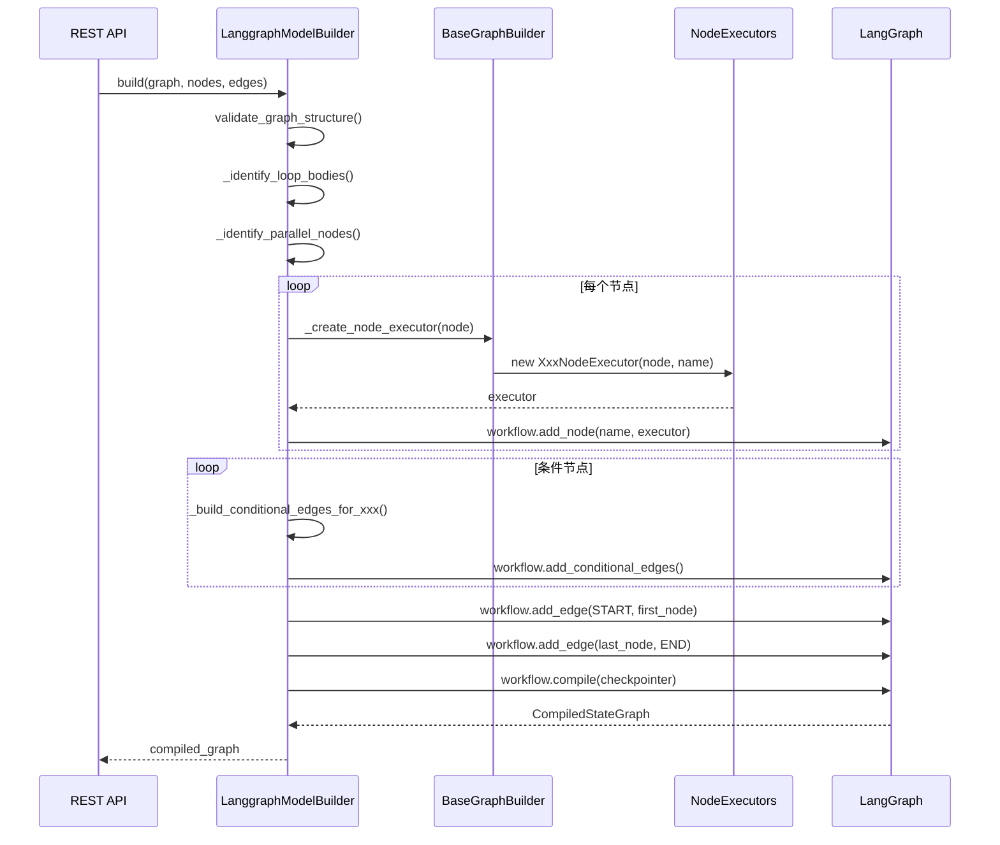
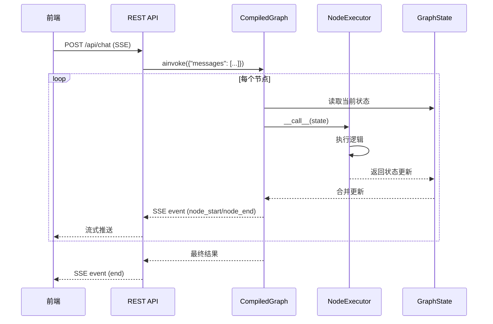
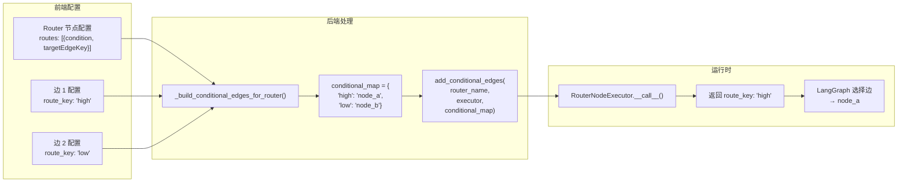
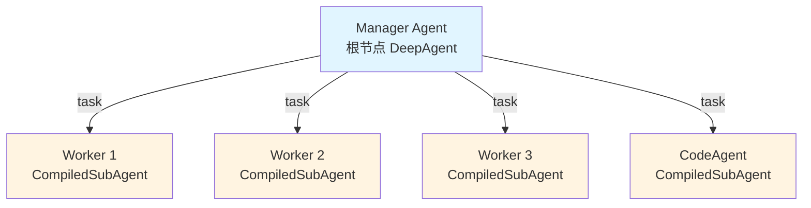
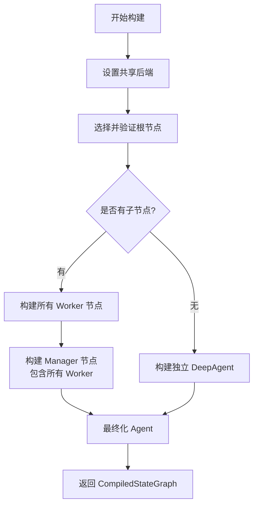
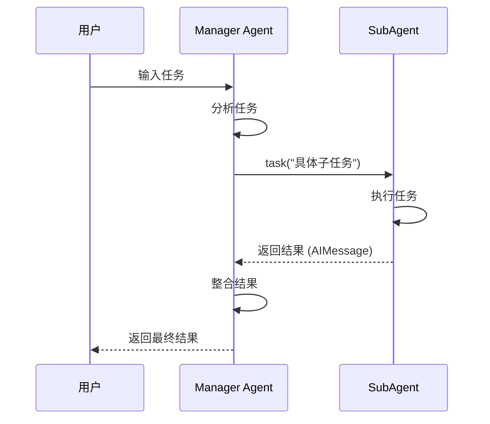

# Graph Builder 系统架构文档

> 本文档整合了后端图构建系统的能力实现与前端实现过程，提供系统性的架构说明。包括标准 LangGraph 构建器和 DeepAgents 构建器两种模式。

---

## 目录

1. [系统架构概览](#1-系统架构概览)
2. [后端核心实现](#2-后端核心实现)
3. [前端核心实现](#3-前端核心实现)
4. [数据流与交互](#4-数据流与交互)
5. [节点类型完整参考](#5-节点类型完整参考)
6. [边配置规范](#6-边配置规范)
7. [状态变量指南](#7-状态变量指南)
8. [最佳实践与模板](#8-最佳实践与模板)
9. [错误处理与调试](#9-错误处理与调试)
10. [DeepAgents 架构](#10-deepagents-架构)

---

## 1. 系统架构概览

### 1.1 整体架构图



### 1.2 构建器选择机制

系统支持两种图构建模式，通过 `GraphBuilder` 工厂类自动选择：

| 构建模式 | 触发条件 | 构建器类 | 适用场景 |
|---------|---------|---------|---------|
| **标准 LangGraph** | 节点未启用 `useDeepAgents` | `LanggraphModelBuilder` | 传统工作流、条件路由、循环控制 |
| **DeepAgents** | 至少一个节点启用 `useDeepAgents` | `DeepAgentsGraphBuilder` | 多 Agent 协作、Manager-Worker 模式 |

**选择逻辑**：
```python
# backend/app/core/graph/graph_builder.py
def _has_deep_agents_nodes(self) -> bool:
    """检查是否有节点启用了 DeepAgents"""
    for node in self.nodes:
        if node.data.get("config", {}).get("useDeepAgents", False):
            return True
    return False

def _create_builder(self) -> BaseGraphBuilder:
    if self._has_deep_agents_nodes():
        return DeepAgentsGraphBuilder(...)
    else:
        return LanggraphModelBuilder(...)
```

### 1.3 核心能力矩阵

| 能力 | 后端实现 | 前端实现 | 说明 |
|------|----------|----------|------|
| **条件路由** | `RouterNodeExecutor` + `add_conditional_edges` | `router_node` + `EdgePropertiesPanel` | 多规则路由，支持优先级 |
| **二元条件** | `ConditionNodeExecutor` | `condition` 节点 | True/False 分支 |
| **循环控制** | `LoopConditionNodeExecutor` | `loop_condition_node` | forEach/while/doWhile |
| **并行执行** | Fan-Out + `AggregatorNodeExecutor` | `aggregator_node` | 支持 fail_fast/best_effort |
| **状态隔离** | `loop_states` / `task_states` | 自动管理 | 防止并行/嵌套循环冲突 |
| **工具调用** | `ToolNodeExecutor` | `tool_node` | 注册表工具执行 |
| **自定义函数** | `FunctionNodeExecutor` + Sandbox | `function_node` | 沙箱执行 Python 代码 |
| **LLM 调用** | `LLMNodeExecutor` | `llm_node` | 模板变量替换 |
| **HTTP 请求** | `HttpRequestNodeExecutor` | `http_request_node` | 重试/认证/超时 |
| **JSON 解析** | `JSONParserNodeExecutor` | `json_parser_node` | JSONPath + Schema 验证 |
| **DeepAgents** | `DeepAgentsGraphBuilder` + `CompiledSubAgent` | `useDeepAgents` 配置 | Manager-Worker 星型拓扑 |

---

## 2. 后端核心实现

### 2.1 GraphBuilder 工厂类

**文件位置**: `backend/app/core/graph/graph_builder.py`

`GraphBuilder` 是图构建的入口工厂类，负责自动检测图配置并选择合适的构建器实现。

#### 核心职责

```python
class GraphBuilder:
    """Factory class that selects appropriate builder based on graph configuration.

    Automatically detects if DeepAgents mode should be used and delegates
    to the appropriate builder implementation.
    """

    def _has_deep_agents_nodes(self) -> bool:
        """检查是否有节点启用了 DeepAgents"""
        for node in self.nodes:
            config = node.data.get("config", {})
            if config.get("useDeepAgents", False) is True:
                return True
        return False

    def _create_builder(self) -> BaseGraphBuilder:
        """创建合适的构建器实例"""
        if self._has_deep_agents_nodes():
            return DeepAgentsGraphBuilder(...)
        else:
            return LanggraphModelBuilder(...)

    async def build(self) -> CompiledStateGraph:
        """异步构建并编译 StateGraph"""
        builder = self._create_builder()
        return await builder.build()
```

#### 构建器选择流程



#### 使用示例

```python
from app.core.graph.graph_builder import GraphBuilder

# 创建构建器（自动选择实现）
builder = GraphBuilder(
    graph=graph,
    nodes=nodes,
    edges=edges,
    llm_model="gpt-4",
    user_id=user_id,
)

# 构建图（自动使用合适的构建器）
compiled_graph = await builder.build()
```

### 2.2 LanggraphModelBuilder 类

**文件位置**: `backend/app/core/graph/langgraph_model_builder.py`

`LanggraphModelBuilder` 是图构建的核心类，继承自 `BaseGraphBuilder`，负责将前端定义的节点和边转换为 LangGraph 的 `StateGraph`。

#### 核心职责

```python
class LanggraphModelBuilder(BaseGraphBuilder):
    """构建标准 LangGraph，支持 START/END 节点。

    支持:
    - 条件路由 (RouterNodeExecutor, ConditionNodeExecutor)
    - 循环 (LoopConditionNodeExecutor)
    - 并行执行 (Fan-Out/Fan-In)
    """

    def __init__(self, *args, **kwargs):
        super().__init__(*args, **kwargs)
        self._conditional_nodes: Set[str] = set()      # 条件边节点
        self._handle_to_route_maps: Dict[str, Dict[str, str]] = {}  # Handle ID 映射
        self._executor_cache: Dict[str, Any] = {}      # 执行器缓存
        self._loop_body_map: Dict[str, str] = {}       # 循环体映射
        self._parallel_nodes: Set[str] = set()         # 并行节点
```

#### 构建流程



#### 关键方法

| 方法 | 功能 |
|------|------|
| `build()` | 异步构建并编译 StateGraph |
| `_build_conditional_edges_for_router()` | 为 Router 节点构建条件边 |
| `_build_conditional_edges_for_condition()` | 为 Condition 节点构建条件边 |
| `_build_conditional_edges_for_loop()` | 为 Loop 节点构建条件边 |
| `_identify_loop_bodies()` | 识别循环体节点 |
| `_identify_parallel_nodes()` | 识别 Fan-Out 节点 |
| `_wrap_node_executor()` | 包装执行器（自动状态更新） |

### 2.2 BaseGraphBuilder 基类

**文件位置**: `backend/app/core/graph/base_builder.py`

提供节点/边管理、执行器创建等基础功能。

#### 核心功能

```python
class BaseGraphBuilder(ABC):
    def __init__(
        self,
        graph: AgentGraph,
        nodes: List[GraphNode],
        edges: List[GraphEdge],
        llm_model: Optional[str] = None,
        api_key: Optional[str] = None,
        base_url: Optional[str] = None,
        max_tokens: int = 4096,
        user_id: Optional[Any] = None,
        checkpointer: Optional[Any] = None,
        model_service: Optional[Any] = None,
    ):
        # 构建查找映射
        self._node_map: Dict[uuid.UUID, GraphNode] = {n.id: n for n in nodes}
        self._node_id_to_name: Dict[uuid.UUID, str] = {}
        self._outgoing_edges: Dict[uuid.UUID, List[uuid.UUID]] = {}
        self._incoming_edges: Dict[uuid.UUID, List[uuid.UUID]] = {}
```

#### 执行器创建

```python
async def _create_node_executor(self, node: GraphNode, node_name: str) -> Any:
    """根据节点类型创建对应的执行器"""
    node_type = self._get_node_type(node)

    if node_type == "agent":
        return AgentNodeExecutor(node, node_name, ...)
    elif node_type == "condition":
        return ConditionNodeExecutor(node, node_name)
    elif node_type == "router_node":
        return RouterNodeExecutor(node, node_name)
    elif node_type == "loop_condition_node":
        return LoopConditionNodeExecutor(node, node_name)
    # ... 其他节点类型
```

### 2.3 节点执行器 (NodeExecutors)

**文件位置**: `backend/app/core/graph/node_executors.py`

#### 执行器类型

| 执行器 | 返回类型 | 核心功能 |
|--------|----------|----------|
| `AgentNodeExecutor` | `Dict[str, Any]` | LLM Agent 调用，支持工具 |
| `ConditionNodeExecutor` | `Dict[str, Any]` → `str` (route_key) | 条件表达式求值 |
| `RouterNodeExecutor` | `str` (route_key) | 多规则路由 |
| `LoopConditionNodeExecutor` | `str` (continue_loop/exit_loop) | 循环条件控制 |
| `ToolNodeExecutor` | `Dict[str, Any]` | 执行注册工具 |
| `FunctionNodeExecutor` | `Dict[str, Any]` | 沙箱执行自定义代码 |
| `AggregatorNodeExecutor` | `Dict[str, Any]` | 聚合并行结果 |
| `LLMNodeExecutor` | `Dict[str, Any]` | 单次 LLM 调用 |
| `JSONParserNodeExecutor` | `Dict[str, Any]` | JSON 解析/转换 |
| `HttpRequestNodeExecutor` | `Dict[str, Any]` | HTTP 请求（带重试） |
| `DirectReplyNodeExecutor` | `Dict[str, Any]` | 模板消息回复 |

#### RouterNodeExecutor 示例

```python
class RouterNodeExecutor:
    """多规则路由执行器"""

    def __init__(self, node: GraphNode, node_id: str):
        self.node = node
        self.node_id = node_id
        self.rules = self._get_rules()  # 按优先级排序
        self.handle_to_route_map: Dict[str, str] = {}

    async def __call__(self, state: GraphState) -> str:
        """返回 route_key，映射到条件边"""
        for rule in self.rules:
            if self._evaluate_rule(rule, state):
                route_key = rule.get("targetEdgeKey", "default")
                return route_key
        return self.default_route
```

### 2.4 GraphState 状态定义

**文件位置**: `backend/app/core/graph/graph_state.py`

```python
class GraphState(MessagesState):
    """工作流图状态，支持复杂流程模式"""

    # ==================== 基础字段 ====================
    messages: Annotated[List[BaseMessage], add_messages]
    current_node: Optional[str]
    context: Dict[str, Any]
    todos: NotRequired[Annotated[List[Dict[str, Any]], add_todos]]

    # ==================== 路由控制 ====================
    route_decision: NotRequired[str]
    route_history: NotRequired[Annotated[List[str], operator.add]]

    # ==================== 循环控制 ====================
    loop_count: NotRequired[int]
    loop_condition_met: NotRequired[bool]
    max_loop_iterations: NotRequired[int]

    # ==================== 并行执行 ====================
    task_results: NotRequired[Annotated[List[Dict[str, Any]], add_task_results]]
    parallel_results: NotRequired[Annotated[List[Any], operator.add]]

    # ==================== 作用域状态 ====================
    loop_states: NotRequired[Annotated[Dict[str, Dict[str, Any]], merge_loop_states]]
    task_states: NotRequired[Annotated[Dict[str, Dict[str, Any]], merge_task_states]]
    node_contexts: NotRequired[Annotated[Dict[str, Dict[str, Any]], merge_node_contexts]]
```

#### Reducer 函数

| Reducer | 作用 |
|---------|------|
| `add_messages` | 追加消息列表 |
| `add_task_results` | 追加任务结果 |
| `merge_loop_states` | 深度合并循环状态（避免并发冲突） |
| `merge_task_states` | 深度合并任务状态 |
| `merge_node_contexts` | 深度合并节点上下文 |

---

## 3. 前端核心实现

### 3.1 节点注册表 (nodeRegistry)

**文件位置**: `frontend/app/workspace/[workspaceId]/[agentId]/services/nodeRegistry.tsx`

#### 注册表结构

```typescript
interface NodeDefinition {
  type: string           // 节点类型标识
  label: string          // 显示名称
  subLabel?: string      // 副标题
  icon: LucideIcon       // 图标组件
  style: {
    color: string        // 文字颜色类
    bg: string           // 背景颜色类
  }
  defaultConfig: Record<string, unknown>  // 默认配置
  schema: FieldSchema[]  // 配置表单 Schema
}

interface FieldSchema {
  key: string
  label: string
  type: FieldType        // text/textarea/select/number/modelSelect/toolSelector/...
  placeholder?: string
  options?: string[]
  required?: boolean
  description?: string
  // number 类型专用
  min?: number
  max?: number
  step?: number
  // conditionExpr 类型专用
  variables?: string[]   // 可用变量提示
}
```

#### 节点分组

```typescript
export const nodeRegistry = {
  getGrouped: () => ({
    Agents: ['agent', 'llm_node'],
    'Flow Control': ['condition', 'condition_agent', 'router_node', 'loop_condition_node'],
    Actions: ['custom_function', 'http', 'http_request_node', 'human_input', 'direct_reply',
              'tool_node', 'function_node', 'json_parser_node'],
    Aggregation: ['aggregator_node'],
  }),
}
```

### 3.2 状态管理 (builderStore)

**文件位置**: `frontend/app/workspace/[workspaceId]/[agentId]/stores/builderStore.ts`

#### 核心状态

```typescript
interface BuilderState {
  // Canvas 状态
  nodes: Node[]
  edges: Edge[]
  rfInstance: ReactFlowInstance | null
  selectedNodeId: string | null
  selectedEdgeId: string | null

  // 历史状态 (Undo/Redo)
  past: HistoryState[]
  future: HistoryState[]

  // 持久化状态
  graphId: string | null
  graphName: string | null
  workspaceId: string | null
  lastAutoSaveTime: number | null
  hasPendingChanges: boolean
}
```

#### 关键方法

| 方法 | 功能 |
|------|------|
| `addNode(type, position, label, config)` | 添加节点 |
| `updateNodeConfig(id, config)` | 更新节点配置 |
| `updateEdge(id, data)` | 更新边配置（EdgeData） |
| `selectNode(id)` / `selectEdge(id)` | 选择节点/边 |
| `onConnect(connection)` | 连接处理（自动推断 edge_type） |
| `syncEdgesWithRouteRules(nodeId, routes)` | 同步 Router 路由规则到边 |
| `autoSave()` | 自动保存（防抖 2s） |
| `undo()` / `redo()` | 撤销/重做 |

#### 边连接智能推断

```typescript
onConnect: (connection: Connection) => {
  const sourceType = sourceNode?.data?.type || ''
  const isConditionalSource = ['router_node', 'condition', 'loop_condition_node']
    .includes(sourceType)

  // 自动设置 edge_type
  let edgeType: EdgeData['edge_type'] = isConditionalSource ? 'conditional' : 'normal'

  // 自动推断 route_key
  if (sourceType === 'condition') {
    const hasTrueEdge = edges.some(e => e.data?.route_key === 'true')
    defaultRouteKey = hasTrueEdge ? 'false' : 'true'
  } else if (sourceType === 'loop_condition_node') {
    const hasContinueEdge = edges.some(e => e.data?.route_key === 'continue_loop')
    defaultRouteKey = hasContinueEdge ? 'exit_loop' : 'continue_loop'
  }
  // ...
}
```

### 3.3 边配置面板 (EdgePropertiesPanel)

**文件位置**: `frontend/app/workspace/[workspaceId]/[agentId]/components/EdgePropertiesPanel.tsx`

#### 功能特性

- **边类型选择**: Normal / Conditional / Loop Back
- **Route Key 配置**: 匹配后端路由决策
- **快速选择**: 根据源节点类型提供建议
- **实时验证**: 显示配置错误

```typescript
// 自动生成 Handle ID 建议
const getHandleIdSuggestions = () => {
  if (sourceNodeType === 'router_node') {
    const routes = sourceNode?.data?.config?.routes || []
    return routes.map((r) => ({
      handleId: r.targetEdgeKey,
      routeKey: r.targetEdgeKey,
    }))
  }
  if (sourceNodeType === 'loop_condition_node') {
    return [
      { handleId: 'continue_loop_handle', routeKey: 'continue_loop' },
      { handleId: 'exit_loop_handle', routeKey: 'exit_loop' },
    ]
  }
  if (sourceNodeType === 'condition') {
    return [
      { handleId: 'true_handle', routeKey: 'true' },
      { handleId: 'false_handle', routeKey: 'false' },
    ]
  }
  return []
}
```

### 3.4 类型定义 (graph.ts)

**文件位置**: `frontend/app/workspace/[workspaceId]/[agentId]/types/graph.ts`

```typescript
/**
 * 边数据结构 - 存储在 Edge.data 中
 * 与后端 GraphEdge.data JSONB 字段对应
 */
export interface EdgeData {
  /** 路由键：匹配 Executor 返回值 */
  route_key?: string

  /** React Flow Handle ID */
  source_handle_id?: string

  /** 边类型 */
  edge_type?: 'normal' | 'conditional' | 'loop_back'

  /** 显示标签 */
  label?: string

  /** 条件表达式（边级别条件） */
  condition?: string

  /** 路径控制点（loop_back 边） */
  waypoints?: Array<{ x: number; y: number }>
}

/**
 * Router 节点路由规则
 */
export interface RouteRule {
  id: string
  condition: string       // Python 表达式
  targetEdgeKey: string   // 匹配边的 route_key
  label: string           // 显示名称
  priority?: number       // 优先级（数字越小越优先）
}
```

---

## 4. 数据流与交互

### 4.1 图保存流程



### 4.2 图构建流程



### 4.3 图执行流程



### 4.4 条件路由数据流



---

## 5. 节点类型完整参考

### 5.1 Agent 节点

| 字段 | 类型 | 必填 | 说明 |
|------|------|------|------|
| `model` | modelSelect | ✅ | 推理模型 |
| `systemPrompt` | textarea | | 系统指令 |
| `tools` | toolSelector | | 连接的工具 |
| `skills` | skillSelector | | 连接的技能 |
| `useDeepAgents` | boolean | | 启用 DeepAgents 模式 |
| `description` | textarea | | SubAgent 描述 |
| `enableMemory` | boolean | | 启用长期记忆 |
| `memoryModel` | modelSelect | | 记忆处理模型 |
| `memoryPrompt` | textarea | | 记忆更新提示 |

**后端执行器**: `AgentNodeExecutor`
**返回**: `{ messages: [...], current_node: "..." }`

---

### 5.2 Condition 节点

| 字段 | 类型 | 必填 | 说明 |
|------|------|------|------|
| `expression` | conditionExpr | ✅ | Python 条件表达式 |
| `trueLabel` | text | | True 分支标签 |
| `falseLabel` | text | | False 分支标签 |

**可用变量**: `state`, `messages`, `context`, `current_node`, `loop_count`

**后端执行器**: `ConditionNodeExecutor`
**返回**: `{ route_decision: "true" | "false", route_history: [...] }`

**边配置要求**:
- True 分支: `route_key: "true"`
- False 分支: `route_key: "false"`

---

### 5.3 Router 节点

| 字段 | 类型 | 必填 | 说明 |
|------|------|------|------|
| `routes` | routeList | ✅ | 路由规则列表 |
| `defaultRoute` | text | | 默认路由键 |

**路由规则结构**:
```typescript
interface RouteRule {
  id: string
  condition: string       // "state.get('score', 0) > 80"
  targetEdgeKey: string   // "high_score"
  label: string           // "高分路由"
  priority?: number       // 0 (最高优先)
}
```

**后端执行器**: `RouterNodeExecutor`
**返回**: `route_key` (字符串)

**边配置要求**: 每条边的 `route_key` 必须匹配某个规则的 `targetEdgeKey`

---

### 5.4 Loop Condition 节点

| 字段 | 类型 | 必填 | 说明 |
|------|------|------|------|
| `conditionType` | select | ✅ | forEach / while / doWhile |
| `listVariable` | text | | forEach: 列表变量名 |
| `condition` | conditionExpr | | while/doWhile: 条件表达式 |
| `maxIterations` | number | ✅ | 最大迭代次数（安全限制） |

**可用变量**: `state`, `loop_count`, `loop_state`, `context`

**后端执行器**: `LoopConditionNodeExecutor`
**返回**: `"continue_loop"` | `"exit_loop"`

**边配置要求**:
- 继续循环: `route_key: "continue_loop"`, `edge_type: "loop_back"`
- 退出循环: `route_key: "exit_loop"`, `edge_type: "conditional"`

---

### 5.5 Tool 节点

| 字段 | 类型 | 必填 | 说明 |
|------|------|------|------|
| `tool_name` | text | ✅ | 工具名称 |
| `input_mapping` | kvList | | 输入参数映射 |

**input_mapping 示例**:
```json
{
  "query": "state.get('context', {}).get('user_query')",
  "limit": "10"
}
```

**后端执行器**: `ToolNodeExecutor`
**返回**: `{ tool_output: [...], messages: [...] }`

---

### 5.6 Function 节点

| 字段 | 类型 | 必填 | 说明 |
|------|------|------|------|
| `function_name` | select | | 预定义函数名 |
| `function_code` | textarea | | 自定义 Python 代码 |

**预定义函数**: `math_add`, `math_multiply`, `string_concat`, `dict_get`, `dict_set`

**自定义代码示例**:
```python
# 使用 result 变量返回结果
result = {
    "output": state.get("value", 0) * 2,
    "status": "success"
}
```

**后端执行器**: `FunctionNodeExecutor` (沙箱执行)
**返回**: `{ function_results: [...] }`

---

### 5.7 Aggregator 节点

| 字段 | 类型 | 必填 | 说明 |
|------|------|------|------|
| `error_strategy` | select | ✅ | fail_fast / best_effort |

**策略说明**:
- `fail_fast`: 任一失败则整体失败
- `best_effort`: 收集所有成功结果，记录失败

**后端执行器**: `AggregatorNodeExecutor`
**返回**: `{ aggregated_results: { status, success_count, error_count, results, errors } }`

---

### 5.8 LLM 节点

| 字段 | 类型 | 必填 | 说明 |
|------|------|------|------|
| `prompt` | textarea | ✅ | Prompt 模板 |
| `model` | modelSelect | ✅ | LLM 模型 |

**模板变量**: `{{variable}}` 从 context 替换，`{{state.field}}` 从 state 替换

**后端执行器**: `LLMNodeExecutor`
**返回**: `{ llm_output: [...], messages: [...] }`

---

### 5.9 JSON Parser 节点

| 字段 | 类型 | 必填 | 说明 |
|------|------|------|------|
| `jsonpath_query` | text | | JSONPath 表达式 |
| `json_schema` | textarea | | JSON Schema 验证 |

**JSONPath 示例**: `$.data.items[*].name`

**后端执行器**: `JSONParserNodeExecutor`
**返回**: `{ context: { json_output: ... } }`

---

### 5.10 HTTP Request 节点

| 字段 | 类型 | 必填 | 说明 |
|------|------|------|------|
| `method` | select | ✅ | GET/POST/PUT/DELETE/PATCH |
| `url` | text | ✅ | URL 模板 |
| `headers` | kvList | | HTTP 头 |
| `auth` | select | | none/bearer/basic |
| `max_retries` | number | | 最大重试次数 |
| `timeout` | number | | 超时秒数 |

**URL 模板**: 支持 `{{variable}}` 变量替换

**后端执行器**: `HttpRequestNodeExecutor`
**返回**: `{ context: { http_response: { status, headers, data, success } } }`

---

### 5.11 Direct Reply 节点

| 字段 | 类型 | 必填 | 说明 |
|------|------|------|------|
| `template` | textarea | | 消息模板 |

**模板**: 支持 `{{variable}}` 从 context 替换

**后端执行器**: `DirectReplyNodeExecutor`
**返回**: `{ messages: [...] }`

---

## 6. 边配置规范

### 6.1 EdgeData 完整结构

```typescript
interface EdgeData {
  /**
   * 路由键 - 匹配节点执行器返回的路由决策
   *
   * 示例:
   * - Condition 节点: "true" | "false"
   * - Router 节点: 自定义键如 "high_score", "default"
   * - Loop 节点: "continue_loop" | "exit_loop"
   */
  route_key?: string

  /**
   * React Flow Handle ID
   * 可选，用于高级场景的精确 Handle 绑定
   */
  source_handle_id?: string

  /**
   * 边类型
   * - normal: 普通连接（灰色）
   * - conditional: 条件边（蓝色）
   * - loop_back: 循环回边（紫色虚线）
   */
  edge_type?: 'normal' | 'conditional' | 'loop_back'

  /**
   * 显示标签
   */
  label?: string

  /**
   * 条件表达式（边级别条件，较少使用）
   */
  condition?: string

  /**
   * 路径控制点（loop_back 边可调整路径）
   */
  waypoints?: Array<{ x: number; y: number }>
}
```

### 6.2 边类型与样式

| edge_type | 颜色 | 样式 | 用途 |
|-----------|------|------|------|
| `normal` | `#cbd5e1` (灰) | 实线 1.5px | 普通顺序连接 |
| `conditional` | `#3b82f6` (蓝) | 实线 2px | 条件分支 |
| `loop_back` | `#9333ea` (紫) | 虚线 2.5px | 循环回边 |

### 6.3 条件节点边配置

#### Condition 节点

```typescript
// True 分支
{ route_key: "true", edge_type: "conditional" }

// False 分支
{ route_key: "false", edge_type: "conditional" }
```

#### Router 节点

```typescript
// 假设 routes = [
//   { condition: "score > 80", targetEdgeKey: "high" },
//   { condition: "score > 60", targetEdgeKey: "medium" },
//   { condition: "True", targetEdgeKey: "low" }
// ]

// 边 1
{ route_key: "high", edge_type: "conditional" }

// 边 2
{ route_key: "medium", edge_type: "conditional" }

// 边 3
{ route_key: "low", edge_type: "conditional" }
```

#### Loop Condition 节点

```typescript
// 继续循环（回到循环体）
{ route_key: "continue_loop", edge_type: "loop_back" }

// 退出循环
{ route_key: "exit_loop", edge_type: "conditional" }
```

### 6.4 后端边处理逻辑

```python
def _build_conditional_edges_for_router(self, workflow, router_node, router_node_name, router_executor):
    conditional_map = {}
    handle_to_route_map = {}

    for edge in self.edges:
        if edge.source_node_id == router_node.id:
            edge_data = edge.data or {}
            source_handle_id = edge_data.get("source_handle_id")
            route_key = edge_data.get("route_key", "default")

            # 构建 Handle ID 到 route_key 的映射
            if source_handle_id:
                handle_to_route_map[source_handle_id] = route_key

            # 构建 route_key 到目标节点的映射
            target_name = self._node_id_to_name.get(edge.target_node_id)
            if target_name:
                conditional_map[route_key] = target_name

    # 设置 Handle 映射到执行器
    router_executor.set_handle_to_route_map(handle_to_route_map)

    # 添加条件边
    workflow.add_conditional_edges(
        router_node_name,
        router_executor,  # 返回 route_key
        conditional_map,  # route_key -> target_node_name
    )
```

---

## 7. 状态变量指南

### 7.1 全局可用变量

| 变量 | 路径 | 类型 | 说明 |
|------|------|------|------|
| `current_node` | `state.current_node` | string | 当前节点 ID |
| `route_decision` | `state.route_decision` | string | 最新路由决策 |
| `loop_count` | `state.loop_count` | number | 全局循环计数 |
| `messages` | `state.messages` | array | 消息列表 |
| `context` | `state.context` | object | 全局上下文 |

### 7.2 作用域变量

#### 循环作用域 (loop_states)

```python
loop_states = {
    "loop_node_id_1": {
        "loop_count": 3,
        "current_index": 2,    # forEach 模式
        "data": {...},
        "items": [...]         # forEach 列表
    }
}

# 访问方式
loop_states.get('loop_node_id').get('loop_count', 0)
```

#### 任务作用域 (task_states)

```python
task_states = {
    "task_node_id_1": {
        "status": "success",
        "result": {...},
        "error_msg": None,
        "task_id": "task_123"
    }
}

# 访问方式
task_states.get('task_node_id').get('result')
```

#### 并行结果 (task_results vs parallel_results)

| 字段 | 用途 | 结构 |
|------|------|------|
| `task_results` | Aggregator 节点聚合 | 标准化结构，包含 status/result/error_msg/task_id |
| `parallel_results` | 通用并行结果 | 任意类型列表，用于未来扩展 |

**task_results 标准结构**:
```python
task_results = [
    {
        "status": "success",      # "success" | "error"
        "result": {...},          # 任务结果
        "error_msg": None,        # 错误信息（如果有）
        "task_id": "node_id"      # 任务节点 ID
    },
    ...
]

# Aggregator 节点使用
errors = [r for r in task_results if r.get("status") == "error"]
successes = [r for r in task_results if r.get("status") == "success"]
```

**自动填充**: `NodeExecutionWrapper` 在并行节点执行完成后自动填充 `task_results`

### 7.3 条件表达式评估上下文

所有条件节点（Router、Condition、Loop）在评估表达式时，都会创建一个安全的评估上下文：

```python
# 后端 NodeExecutors 中的评估上下文
eval_context = {
    "state": dict(state),                    # 完整状态字典
    "context": state.get("context", {}),     # 用户定义的上下文变量
    "messages": state.get("messages", []),   # 消息列表
    "current_node": state.get("current_node"),
    "loop_count": state.get("loop_count", 0),
    "route_decision": state.get("route_decision"),

    # 循环节点额外变量
    "loop_state": loop_states.get(self.node_id, {}),  # 当前循环状态
}

# 表达式在沙箱中执行（无 __builtins__）
result = eval(expression, {"__builtins__": {}}, eval_context)
```

### 7.4 表达式使用示例

```python
# Router 条件 - 访问 context 变量
state.get('context', {}).get('score', 0) > 80
context.get('user_type') == 'vip'

# Condition 表达式 - 检查消息数量
len(state.get('messages', [])) > 5
len(messages) > 5  # 简写形式

# Loop 条件 - 复合条件
loop_count < 3 and state.get('context', {}).get('has_error') == False
loop_count < 3 and context.get('has_error', False) == False

# forEach 条件 - 检查迭代进度
loop_states.get('loop_condition_node_id', {}).get('current_index', 0) < len(loop_states.get('loop_condition_node_id', {}).get('items', []))

# 访问最后一条消息内容
messages[-1].content if messages else ''

# 检查路由历史
'high' in state.get('route_history', [])
```

### 7.5 安全注意事项

- 表达式在沙箱环境中执行，`__builtins__` 被禁用
- 只能访问评估上下文中提供的变量
- 不支持导入模块或执行任意代码
- 复杂逻辑应使用 Function 节点（支持完整 Python 沙箱）

### 7.4 模板变量替换

```python
# Direct Reply / LLM 节点模板
"Hello {{user_name}}, your score is {{score}}"

# 对应 context
context = {
    "user_name": "Alice",
    "score": 95
}

# 也支持 state 访问
"Current node: {{state.current_node}}"
```

---

## 8. 最佳实践与模板

### 8.1 条件分支模板

```
                    ┌─── [Yes] ─→ Agent A
User Input → Condition
                    └─── [No] ──→ Agent B
```

**配置要点**:
1. Condition 节点设置 `expression`
2. True 分支边设置 `route_key: "true"`
3. False 分支边设置 `route_key: "false"`

---

### 8.2 多规则路由模板

```
             ┌─── [High] ────→ Premium Agent
             │
Router ──────┼─── [Medium] ──→ Standard Agent
             │
             └─── [Default] ─→ Basic Agent
```

**配置要点**:
1. Router 节点配置 `routes` 数组（按优先级排序）
2. 每条边的 `route_key` 匹配对应规则的 `targetEdgeKey`
3. 确保有默认路由处理未匹配情况

---

### 8.3 循环处理模板

```
                  ┌──────────────────────┐
                  │                      │
                  ↓                      │
Start → Loop Condition ─[continue]─→ Process ─┘
              │
              └─[exit]─→ End
```

**配置要点**:
1. Loop Condition 设置 `conditionType`、`condition`、`maxIterations`
2. continue 边: `route_key: "continue_loop"`, `edge_type: "loop_back"`
3. exit 边: `route_key: "exit_loop"`, `edge_type: "conditional"`

---

### 8.4 并行聚合模板

```
         ┌─→ Task A ─┐
         │           │
Start ───┼─→ Task B ─┼─→ Aggregator → End
         │           │
         └─→ Task C ─┘
```

**配置要点**:
1. Fan-Out: 一个节点连接多个目标（普通边）
2. Aggregator 节点设置 `error_strategy`
3. 任务结果通过 `task_results` 状态传递

---

### 8.5 错误重试模板

```
                    ┌─────────────────────┐
                    │                     │
                    ↓                     │
Start → API Call → Check Error ─[retry]──┘
                        │
                        └─[success]─→ End
```

**配置要点**:
1. 使用 Loop Condition + `doWhile` 模式
2. 条件: `loop_count < 3 and state.get('context', {}).get('has_error', False)`
3. 在循环体内更新 `has_error` 状态

---

## 9. 错误处理与调试

### 9.1 图验证

`BaseGraphBuilder` 提供编译时验证：

```python
# 验证图结构
errors = builder.validate_graph_structure()
# 检查: 孤立节点、Router 无出边、Loop 缺少边

# 验证 Handle ID 映射
mapping_errors = builder.validate_handle_to_route_mapping()
# 检查: Handle ID 到 route_key 的一致性
```

### 9.2 常见错误

| 错误 | 原因 | 解决方案 |
|------|------|----------|
| Router 无输出 | 没有配置 routes | 添加路由规则 |
| 边缺少 route_key | 条件边未配置 | 在 EdgePropertiesPanel 设置 |
| Loop 死循环 | maxIterations 太大或条件永真 | 检查条件表达式和限制 |
| 表达式求值失败 | 变量未定义或语法错误 | 使用 context 预定义变量 |

### 9.3 调试日志

后端使用 `loguru` 输出详细日志：

```python
# 节点执行日志
[AgentNodeExecutor] >>> Executing node 'agent_1' | input_messages_count=3
[AgentNodeExecutor] <<< Node 'agent_1' completed | elapsed=1234.56ms | new_messages=1

# Router 决策日志
[RouterNodeExecutor] >>> Evaluating router node 'router_1' | rules_count=3
[RouterNodeExecutor] <<< Route selected | route_key=high | elapsed=5.23ms

# Loop 状态日志
[LoopConditionNodeExecutor] >>> Evaluating loop | loop_count=2 | maxIterations=5
[LoopConditionNodeExecutor] <<< Loop condition evaluated | route=continue_loop
```

### 9.4 前端验证

`edgeValidator.ts` 提供实时边配置验证：

```typescript
const errors = validateEdgeData(edge, sourceNode, targetNode)
// 返回: ValidationError[] = [{ field, message, severity }]
```

---

## 10. DeepAgents 架构

### 10.1 GraphBuilder 工厂模式

**文件位置**: `backend/app/core/graph/graph_builder.py`

`GraphBuilder` 作为工厂类，自动检测图配置并选择合适的构建器：

- **检测机制**：扫描所有节点，查找 `config.useDeepAgents === true`
- **选择逻辑**：如果检测到 DeepAgents 节点，使用 `DeepAgentsGraphBuilder`；否则使用 `LanggraphModelBuilder`
- **透明切换**：用户无需关心底层实现，系统自动选择

```python
# 自动选择构建器
builder = GraphBuilder(graph, nodes, edges, ...)
compiled_graph = await builder.build()  # 内部自动选择实现
```

### 10.2 DeepAgentsGraphBuilder

**文件位置**: `backend/app/core/graph/deep_agents_builder.py`

`DeepAgentsGraphBuilder` 实现星型拓扑结构：一个 Manager（根节点）管理多个 Worker（子节点）。

#### 核心职责

```python
class DeepAgentsGraphBuilder(BaseGraphBuilder):
    """Two-level star structure: Root (DeepAgent) → Children (CompiledSubAgent)."""

    def __init__(self, *args, **kwargs):
        super().__init__(*args, **kwargs)
        self._backend_manager = DeepAgentsBackendManager(self.nodes)
        self._skills_manager = DeepAgentsSkillsManager(self.user_id)
        self._node_builder = DeepAgentsNodeBuilder(builder=self)
```

#### 星型拓扑结构



**特点**：
- Manager 是唯一的根节点（DeepAgent）
- 所有 Worker 都是 Manager 的直接子节点（CompiledSubAgent）
- Manager 通过 `task()` 工具委托任务给 Worker
- Worker 之间不直接通信，通过 Manager 协调

#### 构建流程



### 10.3 组件架构

#### 10.3.1 DeepAgentsBackendManager

**文件位置**: `backend/app/core/graph/deep_agents/backend_manager.py`

**职责**：管理共享 Docker 后端，用于技能和 CodeAgent 执行。

**核心功能**：
- 检测是否需要共享后端（有技能配置或 CodeAgent 使用 Docker）
- 创建和管理共享 Docker 容器
- 为节点提供后端实例（共享或节点专用）
- 清理资源

```python
class DeepAgentsBackendManager:
    """Manages shared Docker backend for DeepAgents graph."""

    async def create_shared_backend(self) -> PydanticSandboxAdapter:
        """创建共享 Docker 后端"""

    async def get_backend_for_node(
        self, node: GraphNode, has_skills: bool,
        create_backend_for_node: callable
    ) -> Optional[Any]:
        """获取节点的后端（优先共享后端）"""
```

#### 10.3.2 DeepAgentsSkillsManager

**文件位置**: `backend/app/core/graph/deep_agents/skills_manager.py`

**职责**：管理技能的预加载和路径配置。

**核心功能**：
- 验证技能配置
- 预加载技能到后端沙箱
- 提供技能路径列表
- 诊断技能加载状态

```python
class DeepAgentsSkillsManager:
    """Manages skills for DeepAgents graph."""

    async def preload_skills_to_backend(
        self, node: GraphNode, backend: Any
    ) -> None:
        """预加载技能到后端沙箱"""

    @staticmethod
    def get_skills_paths(
        has_skills: bool, backend: Optional[Any]
    ) -> Optional[list[str]]:
        """获取技能路径列表"""
```

#### 10.3.3 DeepAgentsNodeBuilder (NodeFactory)

**文件位置**: `backend/app/core/graph/deep_agents/node_factory.py`

**职责**：构建各种类型的节点（Root、Manager、Worker、CodeAgent）。

**核心功能**：
- 构建根节点（Root DeepAgent）
- 构建管理器节点（Manager DeepAgent with SubAgents）
- 构建工作节点（Worker CompiledSubAgent）
- 构建 CodeAgent 节点（CodeAgent CompiledSubAgent）

```python
class DeepAgentsNodeBuilder:
    """Builds nodes for DeepAgents graph."""

    async def build_root_node(
        self, node: GraphNode, node_name: str
    ) -> Any:
        """构建根节点（独立 DeepAgent）"""

    async def build_manager_node(
        self, node: GraphNode, node_name: str,
        subagents: list[Any], is_root: bool = False
    ) -> Any:
        """构建管理器节点（带 SubAgents 的 DeepAgent）"""

    async def build_worker_node(self, node: GraphNode) -> Any:
        """构建工作节点（CompiledSubAgent）"""

    async def build_code_agent_node(self, node: GraphNode) -> Any:
        """构建 CodeAgent 节点（CompiledSubAgent）"""
```

#### 10.3.4 AgentConfig / CodeAgentConfig

**文件位置**: `backend/app/core/graph/deep_agents/node_config.py`

**职责**：统一解析节点配置，生成标准化的 Agent 配置对象。

**核心功能**：
- 解析节点数据（tools、skills、backend、middleware 等）
- 统一配置格式（Manager 和 SubAgent 共用）
- 支持 CodeAgent 扩展配置

```python
@dataclass
class AgentConfig:
    """Unified agent configuration - works for both Manager and SubAgent."""
    name: str
    label: str
    node_type: str
    description: Optional[str]
    system_prompt: Optional[str]
    model: Any
    tools: list[Any]
    middleware: list[Any]
    skills: Optional[list[str]]
    backend: Optional[Any]

    @classmethod
    async def from_node(
        cls, node: GraphNode, builder: Any,
        node_id_to_name: dict
    ) -> "AgentConfig":
        """从节点解析配置"""

@dataclass
class CodeAgentConfig(AgentConfig):
    """Extended config for CodeAgent nodes."""
    agent_mode: str = "autonomous"
    executor_type: str = "local"
    enable_data_analysis: bool = True
    # ... 其他 CodeAgent 特定配置
```

### 10.4 数据流

#### 10.4.1 输入处理

SubAgent 的 `runnable` 接收输入，支持多种格式：

```python
# 支持格式 1: 直接任务字符串
{"task": "执行任务"}

# 支持格式 2: LangChain 消息对象
{"messages": [HumanMessage(content="任务内容")]}

# 支持格式 3: 字典格式（fallback）
{"messages": [{"role": "user", "content": "任务内容"}]}
```

**实现**（`node_factory.py`）：
```python
async def code_agent_invoke(inputs: dict) -> dict:
    # 提取任务 - 支持多种格式
    task = inputs.get("task")
    if not task:
        messages = inputs.get("messages", [])
        if messages:
            last_msg = messages[-1]
            if hasattr(last_msg, "content"):  # BaseMessage 对象
                task = last_msg.content
            elif isinstance(last_msg, dict):  # 字典格式
                task = last_msg.get("content", "")
```

#### 10.4.2 输出格式

SubAgent 必须返回 `AIMessage` 对象，符合 DeepAgents 框架要求：

```python
# 正确格式
return {
    "messages": [AIMessage(content="执行结果")],
    "result": result,
}

# DeepAgents 框架会访问 result["messages"][-1].text
```

#### 10.4.3 Manager 与 SubAgent 通信



### 10.5 最佳实践

#### 10.5.1 何时使用 DeepAgents

**适合使用 DeepAgents 的场景**：
- 需要多个专业 Agent 协作完成复杂任务
- 任务可以分解为独立的子任务
- 需要 Manager 协调和决策
- 需要技能共享和代码执行能力

**不适合使用 DeepAgents 的场景**：
- 简单的线性工作流
- 单一 Agent 可以完成的任务
- 不需要 Agent 间协作的场景

#### 10.5.2 节点配置建议

**Manager 节点配置**：
```json
{
  "type": "agent",
  "config": {
    "useDeepAgents": true,
    "systemPrompt": "你是团队协调者，负责分配任务给以下专家：\n- 专家A：负责...\n- 专家B：负责...",
    "description": "团队协调者：管理多个专业 Agent"
  }
}
```

**Worker 节点配置**：
```json
{
  "type": "agent",
  "config": {
    "useDeepAgents": false,
    "description": "专业处理 X 任务的专家",
    "systemPrompt": "你是 X 领域的专家，专注于..."
  }
}
```

**CodeAgent 节点配置**：
```json
{
  "type": "code_agent",
  "config": {
    "useDeepAgents": false,
    "description": "执行 Python 代码的专家",
    "agent_mode": "autonomous",
    "executor_type": "auto"
  }
}
```

#### 10.5.3 性能优化

1. **共享后端**：多个节点使用技能时，系统自动创建共享 Docker 后端，避免重复创建
2. **技能预加载**：在构建时预加载技能到后端，运行时直接读取文件
3. **节点复用**：Manager 可以复用 Worker 处理多个任务
4. **资源清理**：图执行完成后自动清理共享后端资源

#### 10.5.4 常见问题

**Q: 为什么 Worker 节点不需要设置 `useDeepAgents: true`？**

A: 只有 Manager 节点需要设置为 `true`。Worker 节点作为 SubAgent，由 Manager 管理，不需要单独启用。

**Q: 如何确保 Manager 能正确调用 Worker？**

A: Manager 的 `systemPrompt` 中必须列出所有 Worker 的 `description`，这样 Manager 才能知道如何选择合适的 Worker。

**Q: CodeAgent 作为 SubAgent 时需要注意什么？**

A: CodeAgent 的 `runnable` 必须返回 `AIMessage` 对象，而不是字典。系统已自动处理此格式转换。

---

## 附录 A: 文件索引

### 后端文件

| 文件 | 路径 |
|------|------|
| GraphBuilder | `backend/app/core/graph/graph_builder.py` |
| LanggraphModelBuilder | `backend/app/core/graph/langgraph_model_builder.py` |
| DeepAgentsGraphBuilder | `backend/app/core/graph/deep_agents_builder.py` |
| BaseGraphBuilder | `backend/app/core/graph/base_builder.py` |
| NodeExecutors | `backend/app/core/graph/node_executors.py` |
| GraphState | `backend/app/core/graph/graph_state.py` |
| NodeConfigValidator | `backend/app/core/graph/node_config_validator.py` |
| NodeConfigHelper | `backend/app/core/graph/node_config_helper.py` |
| DeepAgentsBackendManager | `backend/app/core/graph/deep_agents/backend_manager.py` |
| DeepAgentsSkillsManager | `backend/app/core/graph/deep_agents/skills_manager.py` |
| DeepAgentsNodeBuilder | `backend/app/core/graph/deep_agents/node_factory.py` |
| AgentConfig | `backend/app/core/graph/deep_agents/node_config.py` |
| BackendFactory | `backend/app/core/graph/deep_agents/backend_factory.py` |

### 前端文件

| 文件 | 路径 |
|------|------|
| nodeRegistry | `frontend/app/workspace/[workspaceId]/[agentId]/services/nodeRegistry.tsx` |
| builderStore | `frontend/app/workspace/[workspaceId]/[agentId]/stores/builderStore.ts` |
| EdgePropertiesPanel | `frontend/app/workspace/[workspaceId]/[agentId]/components/EdgePropertiesPanel.tsx` |
| graph.ts Types | `frontend/app/workspace/[workspaceId]/[agentId]/types/graph.ts` |
| edgeValidator | `frontend/app/workspace/[workspaceId]/[agentId]/services/edgeValidator.ts` |

---

## 附录 B: 前后端 State 协同架构

### B.1 协同架构图

```
┌─────────────────────────────────────────────────────────────────────────────┐
│                             前端 (React Flow)                                │
├─────────────────────────────────────────────────────────────────────────────┤
│                                                                             │
│  ┌─────────────────────────┐    ┌─────────────────────────────────────┐   │
│  │   GraphSettingsPanel    │    │        ConditionExprField           │   │
│  │   (图全局设置)          │    │        (条件表达式编辑器)           │   │
│  │ ┌─────────────────────┐ │    │ ┌─────────────────────────────────┐ │   │
│  │ │ Context Variables   │ │    │ │ Variables hints include:        │ │   │
│  │ │ - retry_count: 3    │ │───▶│ │ - state, messages, context      │ │   │
│  │ │ - user_type: "vip"  │ │    │ │ - context.get('retry_count')    │ │   │
│  │ │ - max_items: 10     │ │    │ │ - context.get('user_type')      │ │   │
│  │ └─────────────────────┘ │    │ └─────────────────────────────────┘ │   │
│  └─────────────────────────┘    └─────────────────────────────────────┘   │
│             │                                                              │
│             ▼                                                              │
│  ┌─────────────────────────────────────────────────────────────────┐      │
│  │                      builderStore                                │      │
│  │  graphVariables: {                                               │      │
│  │    viewport: { x: 0, y: 0, zoom: 1 },                           │      │
│  │    context: { retry_count: 3, user_type: "vip", max_items: 10 } │      │
│  │  }                                                               │      │
│  └──────────────────────────────────────────────────────────────────┘      │
│             │                                                              │
│             │ autoSave() / saveGraph()                                     │
│             ▼                                                              │
│  ┌─────────────────────────────────────────────────────────────────┐      │
│  │                     agentService                                 │      │
│  │  saveGraphState({ nodes, edges, viewport, variables })          │      │
│  │  loadGraphState() → { nodes, edges, viewport, variables }       │      │
│  └─────────────────────────────────────────────────────────────────┘      │
└─────────────────────────────────────────────────────────────────────────────┘
                                   │
                                   │ HTTP API
                                   ▼
┌─────────────────────────────────────────────────────────────────────────────┐
│                             后端 (FastAPI + LangGraph)                       │
├─────────────────────────────────────────────────────────────────────────────┤
│                                                                             │
│  ┌─────────────────────────────────────────────────────────────────┐      │
│  │                      graphs.py API                               │      │
│  │  GraphStatePayload.variables → graph_service.save_graph_state() │      │
│  └─────────────────────────────────────────────────────────────────┘      │
│             │                                                              │
│             ▼                                                              │
│  ┌─────────────────────────────────────────────────────────────────┐      │
│  │                     graph_service.py                             │      │
│  │  save_graph_state(): graph.variables["context"] = variables     │      │
│  │  load_graph_state(): return { variables: graph.variables }      │      │
│  └─────────────────────────────────────────────────────────────────┘      │
│             │                                                              │
│             ▼                                                              │
│  ┌─────────────────────────────────────────────────────────────────┐      │
│  │                     AgentGraph Model                             │      │
│  │  variables: JSONB {                                              │      │
│  │    "viewport": {...},                                            │      │
│  │    "context": {"retry_count": 3, "user_type": "vip", ...}       │      │
│  │  }                                                               │      │
│  └─────────────────────────────────────────────────────────────────┘      │
│             │                                                              │
│             │ (运行时)                                                     │
│             ▼                                                              │
│  ┌─────────────────────────────────────────────────────────────────┐      │
│  │                       chat.py                                    │      │
│  │  get_user_config(graph_id) → initial_context                    │      │
│  │  graph.ainvoke({                                                 │      │
│  │    "messages": [...],                                            │      │
│  │    "context": initial_context  ◀── 从 graph.variables.context   │      │
│  │  })                                                              │      │
│  └─────────────────────────────────────────────────────────────────┘      │
│             │                                                              │
│             ▼                                                              │
│  ┌─────────────────────────────────────────────────────────────────┐      │
│  │                      GraphState                                  │      │
│  │  messages: List[BaseMessage]                                     │      │
│  │  current_node: Optional[str]                                     │      │
│  │  context: Dict[str, Any]  ← 用户定义的变量现在有值了！           │      │
│  │  loop_count: int                                                 │      │
│  │  route_decision: str                                             │      │
│  └─────────────────────────────────────────────────────────────────┘      │
│             │                                                              │
│             ▼                                                              │
│  ┌─────────────────────────────────────────────────────────────────┐      │
│  │                    Node Executors                                │      │
│  │  RouterNodeExecutor:                                             │      │
│  │    eval_context = {                                              │      │
│  │      "state": dict(state),                                       │      │
│  │      "context": state.get("context", {}),  ✅ 有值               │      │
│  │      "loop_count": ...,                                          │      │
│  │    }                                                             │      │
│  │    eval("context.get('retry_count', 0) < 3")  ✅ 正常工作       │      │
│  └─────────────────────────────────────────────────────────────────┘      │
└─────────────────────────────────────────────────────────────────────────────┘
```

### B.2 数据流完整性

```
1. 用户在 GraphSettingsPanel 配置变量
   └─▶ builderStore.updateGraphContext('retry_count', 3)

2. 自动保存触发
   └─▶ agentService.saveGraphState({ variables: { context: {...} } })

3. 后端保存
   └─▶ graph_service.save_graph_state() → graph.variables = {...}

4. 用户运行图
   └─▶ chat.py: get_user_config(graph_id) → initial_context
   └─▶ graph.ainvoke({ "context": initial_context })

5. 条件节点执行
   └─▶ RouterNodeExecutor: eval("context.get('retry_count') < 3") → True ✅
```

### B.3 架构自洽性检查

| 检查点 | 状态 | 说明 |
|--------|------|------|
| 前端配置保存 | ✅ | GraphSettingsPanel → builderStore → agentService → API |
| 后端持久化 | ✅ | API → graph_service → AgentGraph.variables |
| 运行时加载 | ✅ | chat.py 从 graph.variables.context 初始化 GraphState.context |
| 表达式求值 | ✅ | RouterNodeExecutor.eval_context 包含 context |
| 变量提示 | ✅ | ConditionExprField 动态显示用户定义的 context 变量 |
| 回滚支持 | ✅ | DeploymentHistoryPanel 加载时同步 graphVariables |

---

## 附录 C: 版本历史

| 版本 | 日期 | 说明 |
|------|------|------|
| 1.0 | 2026-01-02 | 初始版本，整合所有过程设计文档 |
| 1.1 | 2026-01-02 | 完善前后端 State 协同架构说明 |
| 1.2 | 2026-01-22 | 添加 GraphBuilder 工厂模式和 DeepAgents 架构完整文档 |
