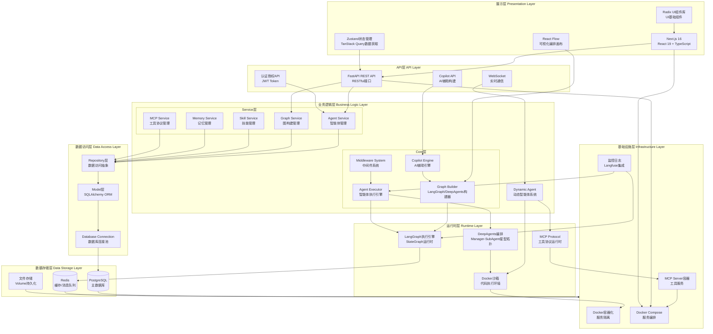

# JoySafeter Agent Platform 分层架构图

## 架构概述

JoySafeter 是一个企业级智能体编排平台，采用分层架构设计，从展示层到基础设施层共分为7个主要层次。

## 分层架构图

## 各层详细说明

### 1. 展示层 (Presentation Layer)
- **Next.js 16**: React全栈框架，提供SSR和路由能力
- **React Flow**: 可视化工作流编排画布，支持拖拽式节点编辑
- **UI组件库**: Radix UI提供无障碍访问的基础组件
- **状态管理**: Zustand管理客户端状态，TanStack Query管理服务器状态

### 2. API层 (API Layer)
- **FastAPI**: 高性能异步Web框架，提供RESTful API
- **WebSocket**: 实时双向通信，支持聊天和通知推送
- **Copilot API**: AI辅助图构建的专用接口
- **认证授权**: JWT Token机制，支持多租户权限控制

### 3. 业务逻辑层 (Business Logic Layer)

#### Service层
- **Agent Service**: 智能体的CRUD操作和生命周期管理
- **Graph Service**: 图构建、版本管理、部署管理
- **Skill Service**: 技能库管理，支持渐进式技能披露
- **Memory Service**: 长短期记忆管理，支持多种检索策略
- **MCP Service**: MCP工具协议的管理和注册

#### Core层
- **Graph Builder**: 支持标准LangGraph和DeepAgents两种构建模式
- **Agent Executor**: 智能体执行引擎，支持流式输出和状态管理
- **Middleware System**: 中间件系统，支持技能注入、记忆管理、可观测性
- **Copilot Engine**: AI辅助图构建引擎，提供智能建议和自动布局

#### Dynamic Agent
- 独立的动态智能体系统，支持会话管理和任务编排

### 4. 数据访问层 (Data Access Layer)
- **Repository层**: 数据访问抽象，隔离业务逻辑和数据库细节
- **Model层**: SQLAlchemy ORM模型定义
- **Database Connection**: 异步数据库连接池管理

### 5. 运行时层 (Runtime Layer)
- **LangGraph**: 基于状态图的工作流执行引擎
- **DeepAgents**: 多智能体星型拓扑编排，Manager协调SubAgent执行
- **Docker沙箱**: 安全的Python代码执行环境
- **MCP Protocol**: Model Context Protocol运行时，支持工具动态调用

### 6. 数据存储层 (Data Storage Layer)
- **PostgreSQL**: 主数据库，存储所有业务数据
- **Redis**: 缓存和消息队列，支持实时通知和状态缓存
- **文件存储**: Docker Volume持久化，存储用户上传文件和技能文件

### 7. 基础设施层 (Infrastructure Layer)
- **Docker**: 容器化部署，提供服务隔离和资源限制
- **Docker Compose**: 服务编排，管理多个容器的生命周期
- **MCP Server容器**: 独立的MCP工具服务容器，支持多工具并行运行
- **监控日志**: Langfuse集成，提供完整的执行追踪和性能分析

## 关键数据流

1. **用户请求流**: 前端 → FastAPI → Service层 → Repository层 → PostgreSQL
2. **图构建流**: React Flow → Graph Builder → LangGraph → 执行引擎
3. **实时通信流**: WebSocket → Dynamic Agent → Docker沙箱 → MCP工具
4. **技能加载流**: Skill Service → SkillSandboxLoader → Docker Volume → Agent执行

## 架构特点

1. **分层清晰**: 每层职责明确，便于维护和扩展
2. **异步优先**: 全面采用异步IO，提高并发性能
3. **可扩展性**: 中间件系统支持插件式扩展
4. **安全性**: Docker沙箱隔离，权限控制完善
5. **可观测性**: 完整的日志和追踪系统

## 技术栈总结

### 前端技术栈
- **框架**: Next.js 16, React 19, TypeScript 5.7
- **UI库**: Radix UI, Tailwind CSS 3.4
- **可视化**: React Flow
- **状态管理**: Zustand, TanStack Query
- **表单处理**: React Hook Form, Zod

### 后端技术栈
- **Web框架**: FastAPI
- **数据库**: PostgreSQL 15, SQLAlchemy 2.0 (异步)
- **缓存**: Redis 7
- **AI框架**: LangChain 1.0, LangGraph 1.0
- **多智能体**: DeepAgents
- **工具协议**: MCP (Model Context Protocol)

### 基础设施
- **容器化**: Docker, Docker Compose
- **监控**: Langfuse
- **部署**: Docker Compose编排

## 相关文档

- [Graph Builder 架构文档](./GRAPH_BUILDER_ARCHITECTURE.md)
- [中间件架构文档](./middleware-architecture-complete.md)
- [MCP工具集成文档](./mcp-skills-integration.md)
- [DeepAgents完整指南](./deepresearch-complete-guide.md)
